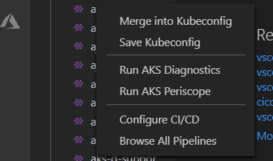
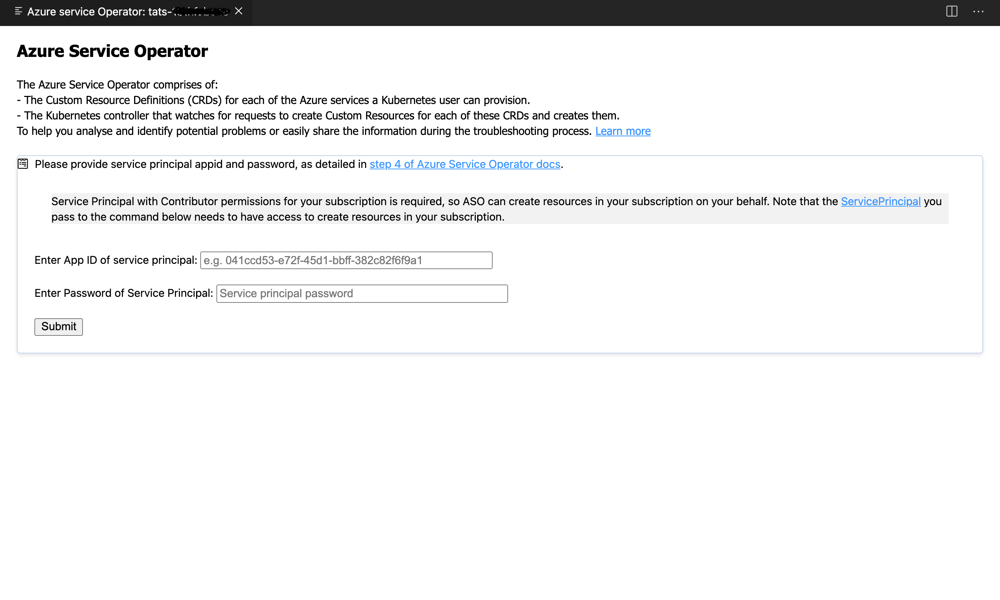

# Azure Kubernetes Service (AKS) Extension for Visual Studio Code (Preview)

* View your AKS clusters in the Kubernetes extension cloud explorer
* Add AKS clusters to kubeconfig
* Perform AKS Diagnostics checks on your AKS cluster 
* Run AKS Periscope within VS Code
* Configure a Continous Integration / Continous Deployment ( CI/CD ) Pipeline targetting AKS cluster from within VSCode
* Browse to all Continous Integration / Continous Deployment ( CI/CD ) Pipelines targetting AKS cluster
* Install Azure Service Operator on your AKS cluster

## Installation

1. Download and install the [Azure Kubernetes Service extension](https://marketplace.visualstudio.com/items?itemName=ms-kubernetes-tools.vscode-aks-tools) for Visual Studio Code.

2. Wait for the extension to finish installing then reload Visual Studio Code when prompted.

3. Once the installation is complete, you'll see a section named **Azure** under **Clouds**.

4. Sign in to your Azure Account by clicking **Sign in to Azure…**

## Features

Once you successfully log in with your Azure Account, you can view all AKS clusters in your Azure subscriptions(s) under the section named **Azure**. You can right click on your AKS cluster and click a menu item to perform following actions.  

### Merge into Kubeconfig

Right click on your AKS cluster and click on **Merge into Kubeconfig** to add the selected AKS cluster to the kubeconfig file.

### Save Kubeconfig

Right click on your AKS cluster and click on **Save Kubeconfig** to save the kubeconfig of the selected AKS cluster.

### AKS Diagnostics

Right click on your AKS cluster and click on **Run AKS Diagnostics** to run a series of checks on your AKS cluster's backend telemetry to get diagnostics information on your network configuration and recommended solutions for network and connectivity issues. Also, to perform more checks on your AKS cluster to troubleshoot and get recommended solutions, click on the AKS Diagnostics link at the top of the page to open it for the selected cluster. For more information on AKS Diagnostics, visit [AKS Diagnostics Overview](https://docs.microsoft.com/azure/aks/concepts-diagnostics).

### AKS Periscope

Right click on your AKS cluster and click on **Run AKS Periscope** to collect node and pod logs for your AKS cluster and to export them to an Azure storage account. Upon selecting the option, a web view will load providing you the option to generate a downloadable link for the collected logs as well as a shareable link with 7-day expiry.

> If you are not seeing the logs for all the nodes, it is possible the logs were still uploading. Try clicking the **Generate Link** button again to load more logs.

For more information, visit [AKS Periscope](https://github.com/Azure/aks-periscope).

#### Configuring Storage Account

Running the AKS Periscope requires you to have a storage account associated with the Diagnostic settings of your AKS cluster. If you have only one storage account associated with the Diagnostic settings of your AKS cluster, the collected logs will be stored in the associated storage account by default. If you have more than one storage account associated with the Diagnostics settings of your AKS cluster, then the extension will prompt you to choose the storage account for saving collected logs. If you don't have a storage account configured in the Diagnostic settings, please follow these instructions to enable it.

1. Navigate to your AKS cluster in the [Azure Portal](https://portal.azure.com/).

2. Click on **Diagnostic Settings** under **Monitoring** in the left navigation.

3. Click on **Add diagnostic setting**.

4. Enter a name, such as myAKSClusterLogs, then select the option to **Archive to a storage account**.

5. Select a storage account of your choice.

6. In the list of available logs, select the logs you wish to enable.
    > Note: The incurred cost is subject to your storage account usage and Azure Storage Policy.

7. When ready, select **Save** to enable collection of the selected logs.

For more information on Diagnostics settings, visit [Create diagnostic settings to send platform logs and metics to different destinations](https://docs.microsoft.com/azure/azure-monitor/platform/diagnostic-settings).

### Configure CI/CD Workflow

Right click on your AKS cluster and click on **Configure CI/CD Workflow** to create a Continous Integration / Continous Deployment (CI/CD) pipeline targetting your cluster. This will use [Deploy to Azure](https://marketplace.visualstudio.com/items?itemName=ms-vscode-deploy-azure.azure-deploy) VSCode extension and have a  guided experience to generate a YAML file defining the build and deploy process.

### Browse CI/CD Workflows

Right click on your AKS cluster and click on **Browse CI/CD Workflows** to view details of all existing Continous Integration / Continous Deployment (CI/CD) pipelines that are configured against your cluster.

### Install Azure Service Operator

Right click on your AKS cluster and click on **Install Azure Service Operator** to easily deploy the latest version of Azure Service Operator (ASO) on your AKS cluster and provision and connect applications to Azure resources within Kubernetes. When you select this option, you'll be prompted for a service principal for ASO to use when performing Azure resource operations. This service principal must have appropriate permissions (typically Contributor at suitable scope). Fill out the service principal details and click **Submit** to kick off the installation of Azure Servic Operator.

> Install Azure Service Operator can only be performed on an AKS cluster that has never had ASO installed before. If you have already initiated the installation manually, follow the instructions on [Azure Service Operator](https://github.com/Azure/azure-service-operator) to complete.

For more information on Azure Service Operator, visit [Azure Service Operator (for Kubernetes)](https://github.com/Azure/azure-service-operator). If you are experiencing issues with Azure Service Operator, visit [Azure Service Operator (ASO) troubleshooting](https://github.com/Azure/azure-service-operator/blob/master/docs/troubleshooting.md).

## Telemetry

This extension collects telemetry data to help us build a better experience for building applications with Azure Kubernetes Service and VS Code. We only collect the following data:

* Which commands are executed.

We do not collect any information about image names, paths, etc. Read our [privacy statement](https://privacy.microsoft.com/privacystatement) to learn more. If you don’t wish to send usage data to Microsoft, you can set the `telemetry.enableTelemetry` setting to `false`. Learn more in our [FAQ](https://code.visualstudio.com/docs/supporting/faq#_how-to-disable-telemetry-reporting).

## Contributing

This project welcomes contributions and suggestions.  Most contributions require you to agree to a
Contributor License Agreement (CLA) declaring that you have the right to, and actually do, grant us
the rights to use your contribution. For details, visit https://cla.microsoft.com.

When you submit a pull request, a CLA-bot will automatically determine whether you need to provide
a CLA and decorate the PR appropriately (e.g., label, comment). Simply follow the instructions
provided by the bot. You will only need to do this once across all repos using our CLA.

This project has adopted the [Microsoft Open Source Code of Conduct](https://opensource.microsoft.com/codeofconduct/).
For more information see the [Code of Conduct FAQ](https://opensource.microsoft.com/codeofconduct/faq/) or
contact [opencode@microsoft.com](mailto:opencode@microsoft.com) with any additional questions or comments.
