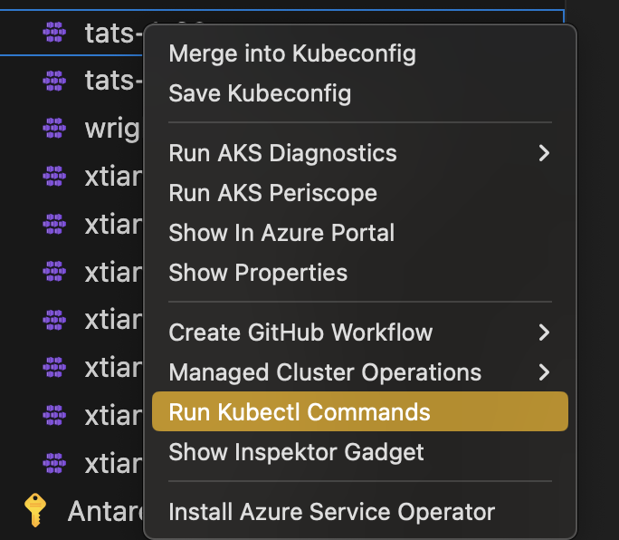
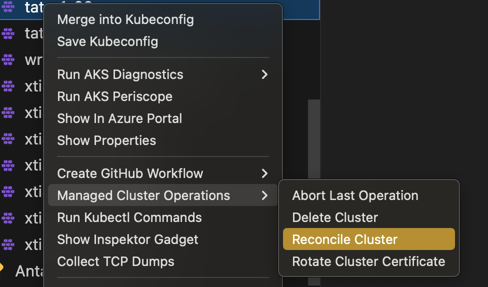

# Azure Kubernetes Service (AKS) Extension for Visual Studio Code

* View your AKS clusters in the Kubernetes extension cloud explorer
* Add AKS clusters to kubeconfig
* Perform AKS Diagnostics checks on your AKS cluster 
* Run AKS Periscope within VS Code
* Install Azure Service Operator on your AKS cluster
* Create GitHub Workflow from your AKS cluster
* Show AKS cluster overview in Azure Portal
* Show AKS cluster properties
* Create AKS cluster from Azure Portal
* Stop and Start the AKS cluster
* Run Kubectl Commands from your AKS cluster
* Run Managed Cluster Operations from your AKS cluster
* Run Kubernetes API Health Endpoints
* Deploy and Undeploy InspektorGadget
* Enable Non-Interactive InspektorGadget Commands like Top, Profile and Snapshot

## Installation

1. Download and install the [Azure Kubernetes Service extension](https://marketplace.visualstudio.com/items?itemName=ms-kubernetes-tools.vscode-aks-tools) for Visual Studio Code.

2. Wait for the extension to finish installing then reload Visual Studio Code when prompted.

3. Once the installation is complete, you'll see a section named **Azure** under **Clouds**.

4. Sign in to your Azure Account by clicking **Sign in to Azure…**

## Features

Once you successfully log in with your Azure Account, you can view all AKS clusters in your Azure subscriptions(s) under the section named **Azure**. You can right click on your AKS cluster and click a menu item to perform following actions.  

### Merge into Kubeconfig

Right click on your AKS cluster and click on **Merge into Kubeconfig** to add the selected AKS cluster to the kubeconfig file.

### Save Kubeconfig

Right click on your AKS cluster and click on **Save Kubeconfig** to save the kubeconfig of the selected AKS cluster.

### AKS Diagnostics

Right click on your AKS cluster and click on **Run AKS Diagnostics** to display diagnostics information based on your AKS cluster's backend telemetry for:

- Best Practices
- Create, Upgrade, Delete and Scale issues
- Identity and Security
- Known Issues, Availability and Performance
- Network and Connectivity issues
- Node Health

To perform further checks on your AKS cluster to troubleshoot and get recommended solutions, click on the AKS Diagnostics link at the top of the page to open it for the selected cluster. For more information on AKS Diagnostics, visit [AKS Diagnostics Overview](https://docs.microsoft.com/azure/aks/concepts-diagnostics). 

### AKS Periscope

Right click on your AKS cluster and click on **Run AKS Periscope** to collect node and pod logs for your AKS cluster and to export them to an Azure storage account. Upon selecting the option, a web view will load providing you the option to generate a downloadable link for the collected logs as well as a shareable link with 7-day expiry.

> If you are not seeing the logs for all the nodes, it is possible the logs were still uploading. Try clicking the **Generate Link** button again to load more logs.

For more information, visit [AKS Periscope](https://github.com/Azure/aks-periscope).

#### Configuring Storage Account

Running the AKS Periscope requires you to have a storage account associated with the Diagnostic settings of your AKS cluster. If you have only one storage account associated with the Diagnostic settings of your AKS cluster, the collected logs will be stored in the associated storage account by default. If you have more than one storage account associated with the Diagnostics settings of your AKS cluster, then the extension will prompt you to choose the storage account for saving collected logs. If you don't have a storage account configured in the Diagnostic settings, please follow these instructions to enable it.

1. Navigate to your AKS cluster in the [Azure Portal](https://portal.azure.com/).

2. Click on **Diagnostic Settings** under **Monitoring** in the left navigation.

3. Click on **Add diagnostic setting**.

4. Enter a name, such as myAKSClusterLogs, then select the option to **Archive to a storage account**.

5. Select a storage account of your choice.

6. In the list of available logs, select the logs you wish to enable.
    > Note: The incurred cost is subject to your storage account usage and Azure Storage Policy.

7. When ready, select **Save** to enable collection of the selected logs.

For more information on Diagnostics settings, visit [Create diagnostic settings to send platform logs and metics to different destinations](https://docs.microsoft.com/azure/azure-monitor/platform/diagnostic-settings).

### Install Azure Service Operator

Right click on your AKS cluster and click on **Install Azure Service Operator** to easily deploy the latest version of Azure Service Operator (ASO) on your AKS cluster and provision and connect applications to Azure resources within Kubernetes. When you select this option, you'll be prompted for a service principal for ASO to use when performing Azure resource operations. This service principal must have appropriate permissions (typically Contributor at suitable scope). Fill out the service principal details and click **Submit** to kick off the installation of Azure Service Operator.

> Install Azure Service Operator can only be performed on an AKS cluster that has never had ASO installed before. If you have already initiated the installation manually, follow the instructions on [Azure Service Operator](https://azure.github.io/azure-service-operator/#installation) to complete.

For more information on Azure Service Operator, visit [Azure Service Operator (for Kubernetes)](https://github.com/Azure/azure-service-operator). If you are experiencing issues with Azure Service Operator, visit [Azure Service Operator (ASO) troubleshooting](https://github.com/Azure/azure-service-operator/blob/master/docs/troubleshooting.md).

### Create GitHub Workflow

Right click on your AKS cluster and click on **Create GitHub Workflow** to easily open and create a workflow starter template. This helps in quick generation of the workflow templates with pre populates resource and clustername for:

- [Starter Workflow](https://github.com/actions/starter-workflows/blob/main/deployments/azure-kubernetes-service.yml)
- [Helm Workflow](https://github.com/actions/starter-workflows/blob/main/deployments/azure-kubernetes-service-helm.yml)
- [Kompose Workflow](https://github.com/actions/starter-workflows/blob/main/deployments/azure-kubernetes-service-kompose.yml)
- [Kustomize Workflow](https://github.com/actions/starter-workflows/blob/main/deployments/azure-kubernetes-service-kustomize.yml)

### Show in Azure Portal

Right click on your AKS cluster and click on **Show in Azure Portal** to easily navigate to AKS cluster overview page in Azure Portal.

### Show Properties

Right click on your AKS cluster and click on **Show Properties** to display the AKS cluster and agent pool properties like provisioning state, fqdn, k8s version, along with node properties like node version, vm type, vm size, o/s type, o/s disk size and nodes provisioning state.

### Create cluster from Azure Portal

Right click on your AKS sunscription and click on **Create cluster from Azure Portal** to easily navigate to AKS create cluster page in Azure Portal.

### Start or Stop AKS cluster

Right click on your AKS cluster and click on **Show Properties** to display the AKS cluster properties, within the page there will be **Stop/Start Cluster** button to perform the start or stop the cluster operation.

### Run Kubectl Commands from your AKS cluster

Right click on your AKS cluster and click on **Run Kubectl Commands** to easily run few known kubectl commands on your cluster. Currently we have enable following kubectl commands for the AKS cluster:

- Describe Services
- Get All Pods
- API Resources
- Get Cluster Info
- Get Node
- Get All Events

### Run Managed Cluster Operations from your AKS cluster

Right click on your AKS cluster and click on **Managed Cluster Operations** to easily run few managed cluster operations on your cluster. Currently we have enable following operations:

- Delete Cluster
- Rotate Cluster Certificate

### Run Kubernetes API Health Endpoints

Right click on your AKS cluster and click on **Kubernetes API Health Endpoints** to easily run few [k8s cluster API endpoint health check](https://kubernetes.io/docs/reference/using-api/health-checks/). Currently we have enable following health check:

- Healthz
- Livez
- Readyz

### Deploy and Undeploy InspektorGadget

Right click on your AKS cluster and click on **Inspektor Gadget** to easily deploy gadget into your cluster. User can easily one-click deploy and undeploy gadget from this feature.

### Profile, Top and Snapshot Inspektor Gadget Commands

After successfully deploying Inspektor Gadget, right-click on your AKS cluster and select **Inspektor Gadget** and choose **Gadget Commands** to easily use non-interactive Top, Profile or Snapshot commands for your cluster.

## Telemetry

This extension collects telemetry data to help us build a better experience for building applications with Azure Kubernetes Service and VS Code. We only collect the following data:

* Which commands are executed.

We do not collect any information about image names, paths, etc. Read our [privacy statement](https://privacy.microsoft.com/privacystatement) to learn more. If you don’t wish to send usage data to Microsoft, you can set the `telemetry.enableTelemetry` setting to `false`. Learn more in our [FAQ](https://code.visualstudio.com/docs/supporting/faq#_how-to-disable-telemetry-reporting).

## Contributing

This project welcomes contributions and suggestions.  Most contributions require you to agree to a
Contributor License Agreement (CLA) declaring that you have the right to, and actually do, grant us
the rights to use your contribution. For details, visit https://cla.microsoft.com.

When you submit a pull request, a CLA-bot will automatically determine whether you need to provide
a CLA and decorate the PR appropriately (e.g., label, comment). Simply follow the instructions
provided by the bot. You will only need to do this once across all repos using our CLA.

This project has adopted the [Microsoft Open Source Code of Conduct](https://opensource.microsoft.com/codeofconduct/).
For more information see the [Code of Conduct FAQ](https://opensource.microsoft.com/codeofconduct/faq/) or
contact [opencode@microsoft.com](mailto:opencode@microsoft.com) with any additional questions or comments.
