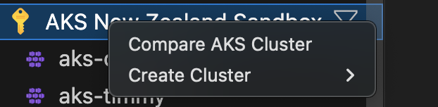
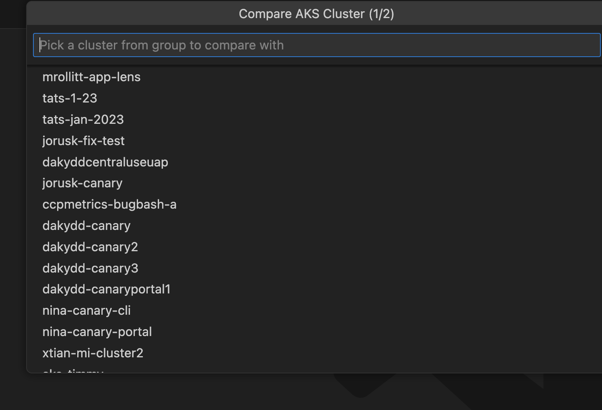
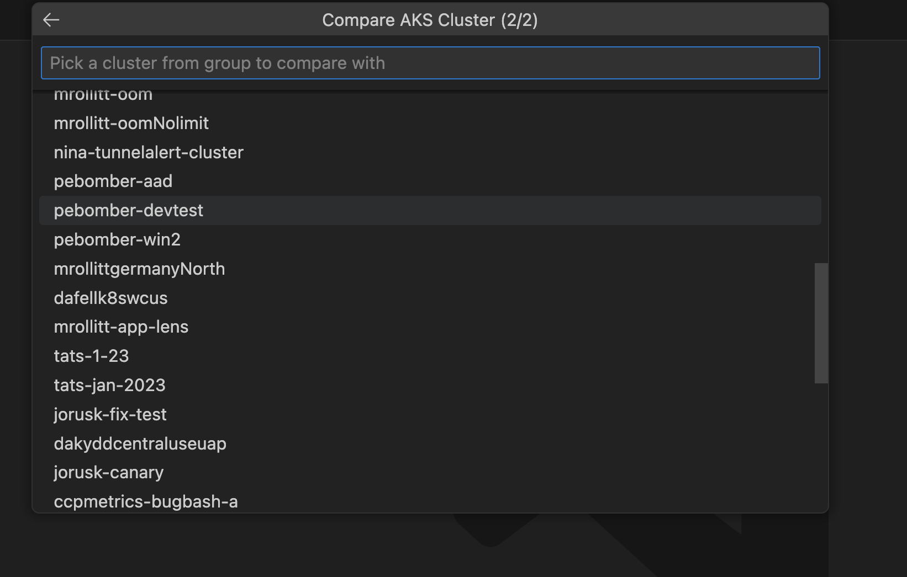
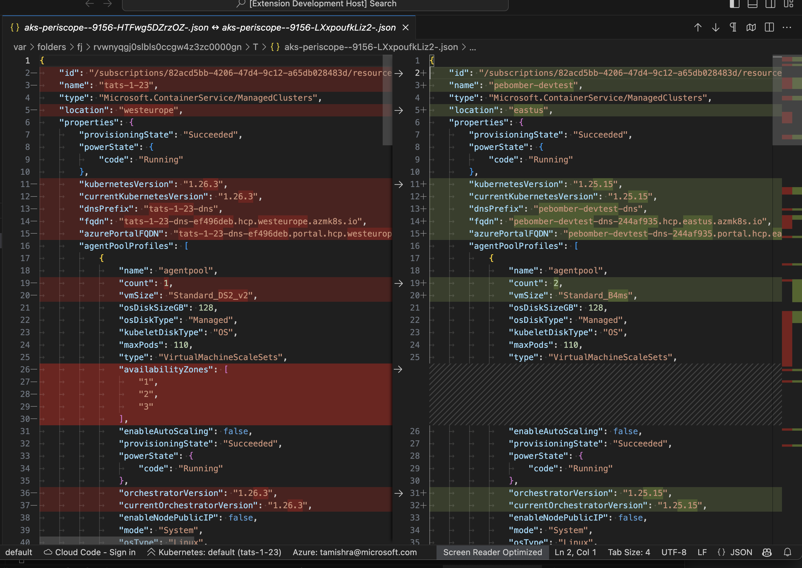

# Compare 2 AKS Cluster within Same Subscription

### Compare AKS Clusters

Right click on your AKS cluster and select **Compare AKS Cluster** to use vscode diff to compare json object of 2 AKS clusters.

