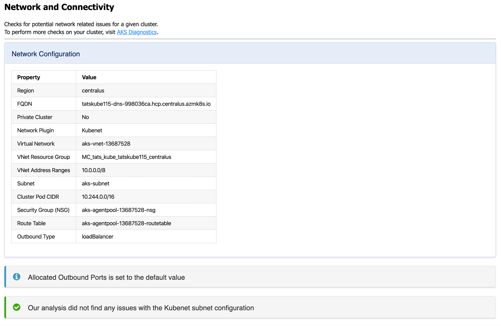

# AKS Diagnostics

## AKS Diagnostics

Right-click your AKS cluster > **Troubleshoot & Diagnose** > **Run AKS Diagnostics** to display diagnostics information based on your AKS cluster's backend telemetry for:

- Create, Upgrade, Delete and Scale
- Network Connectivity Issues
- Best Practices
- Identity and Security
- Node Health
- Cluster and Control Plane Availability and Performance
- Storage

To perform further checks on your AKS cluster to troubleshoot and get recommended solutions, click on the AKS Diagnostics link at the top of the page to open it for the selected cluster. For more information on AKS Diagnostics, visit [AKS Diagnostics Overview](https://docs.microsoft.com/azure/aks/concepts-diagnostics). 

