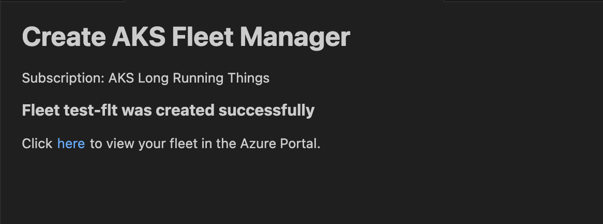

# AKS Fleet Manager

The AKS Fleet Manager provides toolkits to create and manage Fleet resources, displayed in a Treeview.

### Create a Fleet

1. Right-click on the subscription where you want to create your Fleet.
2. Select **Fleet Manager** and then click on **Create Fleet**.

The UI will display a loading page. Once all resource groups and locations are loaded, an input form will be shown.

Fill in all required fields marked with an asterisk (*). Invalid inputs will be rejected, and an error message will explain the reason for the failure.

After entering valid inputs in all required fields, submit the form to create the Fleet resource. A loading page will appear until the API returns the result.

If the Fleet is created successfully, a success page will be displayed with a link to view the new Fleet in the Azure portal.

If there is an error during creation, a failure page will be displayed with the error message from the API.

