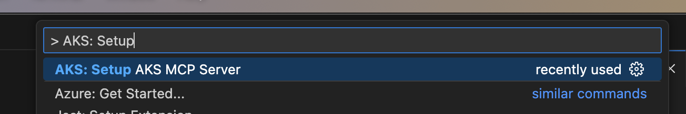
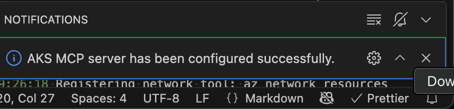
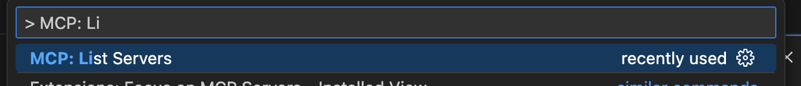
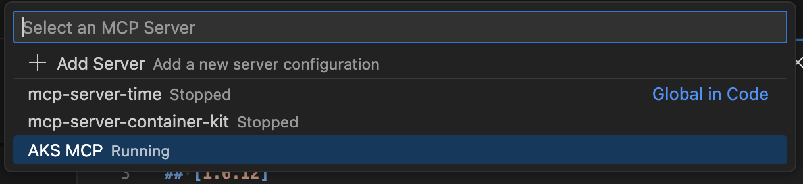
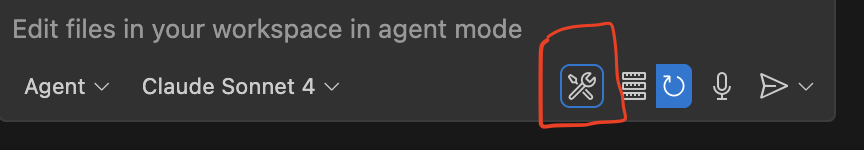
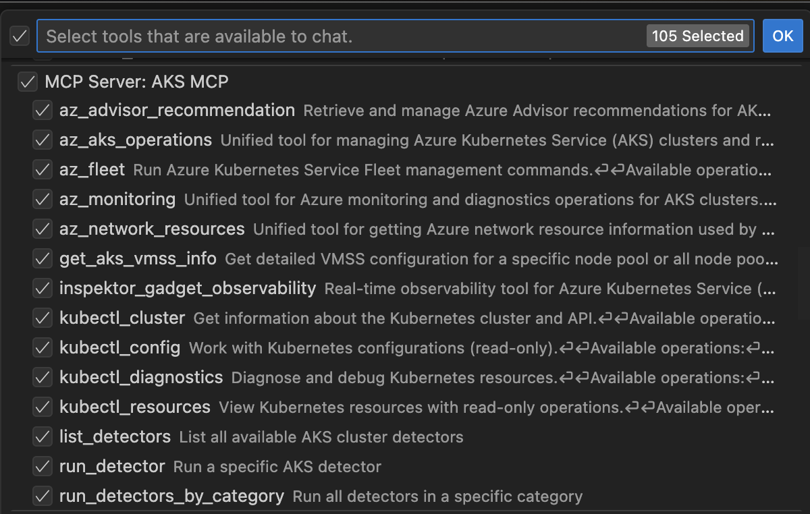

# Setup AKS MCP Server

### AKS: Setup AKS MCP Server

The `AKS: Setup MCP Server` command is now available via the **Command Palette**. This command provisions a lightweight Model Context Protocol (MCP) server locally for enhanced Copilot Chat integration with AKS clusters.

### How to Launch

1. Open the **Command Palette** (`Cmd+Shift+P` on macOS / `Ctrl+Shift+P` on Windows/Linux).
2. Search and run: `AKS: Setup MCP Server`.

### On Successful Setup

Upon successful installation, you’ll see a successful message like below:

The server will now be visible in:

* `MCP: List Servers` (via Command Palette)

From there, you can:

* Start the MCP server
* View its status

Once started, the MCP server will appear in the **Copilot Chat: Configure Tool** dropdown as a custom system tool, ready to enhance contextual prompts based on your AKS environment. By default, all AKS MCP server tools are enabled. You can review the list of available tools and disable any that are not required for your specific scenario.

* Begin interacting with your AKS clusters via Copilot using natural language prompts.

### Troubleshooting

If the server does not appear:

* Ensure it was started using the `MCP: Start Server` command.
* Confirm it shows up in `MCP: List Servers`.
* Restart VS Code if needed.
