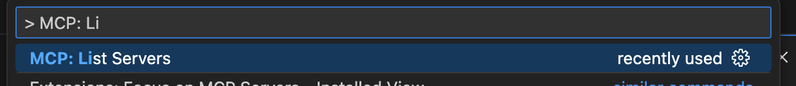
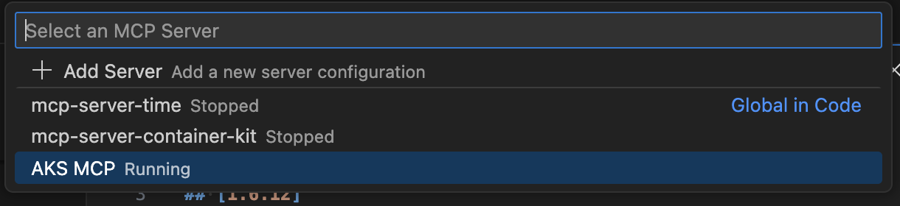
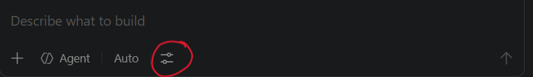
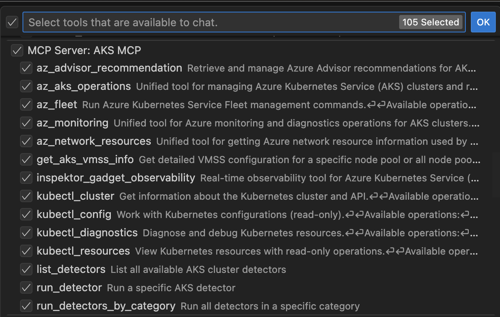

# AKS MCP Server

The AKS extension registers a Model Context Protocol (MCP) server that gives Copilot Chat contextual access to your AKS clusters. The server is registered automatically — there is no setup command to run.

### How to Use

1. Open the **Command Palette** (`Cmd+Shift+P` on macOS / `Ctrl+Shift+P` on Windows/Linux) and run `MCP: List Servers`.
2. Find **AKS MCP** in the list and start it. The first start downloads the server binary, and subsequent starts will use the stored copy.





Once started, the AKS MCP server appears in the **Copilot Chat: Configure Tools** dropdown. 





### Remote development (WSL, Remote-SSH, Dev Containers)

The server registers itself in whichever extension host you're connected to, and the binary downloads to that same machine on first usage. No additional setup is required.

### Limiting Enabled Components

Some components require local CLI tools (e.g. `helm`, `cilium`, `hubble`). The default configuration enables `az_cli`, `monitor`, `fleet`, `network`, `compute`, `detectors`, `advisor`, `inspektorgadget`, and `kubectl` to ensure a comprehensive setup out of the box. You can change this by setting `aks.aksmcpserver.enabledComponents` in your VS Code user settings.

```json
"aks.aksmcpserver.enabledComponents": "az_cli,kubectl,monitor,network"
```

Available components: `az_cli`, `monitor`, `fleet`, `network`, `compute`, `detectors`, `advisor`, `inspektorgadget`, `kubectl`, `helm`, `cilium`, `hubble`. Set to an empty string to enable all components.

### Pinning the Server Version

The extension pins a specific `aks-mcp` release via the `aks.aksmcpserver.releaseTag` setting. Override it to test a different release. Binaries are cached at `~/.vs-kubernetes/tools/aks-mcp/<version>/`; you can delete old versions manually if needed.

### Troubleshooting

* If the server doesn't appear in `MCP: List Servers`, restart VS Code so the extension can re-register the provider.
* If the server fails to start, open `MCP: List Servers`, select **AKS MCP**, and choose **Show Output** to view the server log.

