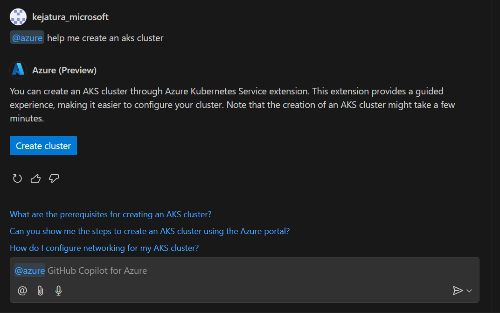
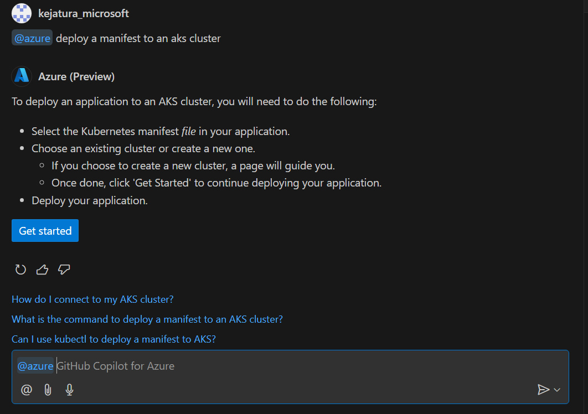
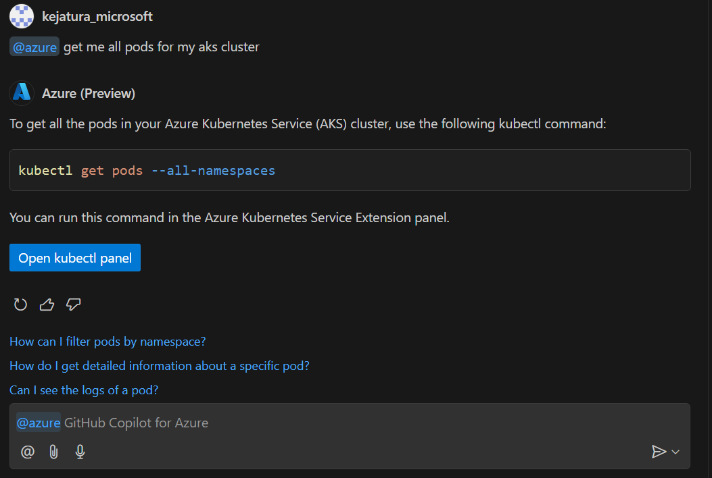

# **AKS Plugins for GitHub Copilot for Azure**

## **Overview**

The AKS plugins (or skills) for GitHub Copilot for Azure (@azure) extension enable users to perform various tasks related to Azure Kubernetes Service (AKS) directly from the GitHub Copilot Chat view. These skills include creating an AKS cluster, deploying a manifest to an AKS cluster, and generating Kubectl commands.

## **Features**

### **Create an AKS Cluster**

> Users can quickly set up an AKS cluster using simple, natural language prompts. This reduces the complexity and time required to manually configure and deploy a Kubernetes cluster.

You can create an AKS cluster using the following prompts:

- \[@azure\] can you help me create a Kubernetes cluster
- \[@azure\] can you set up an AKS cluster for me?
- \[@azure\] I have a containerized application, can you help me create an AKS cluster to host it?
- \[@azure\] create AKS cluster
- \[@azure\] Help me create a Kubernetes cluster to host my application

### **Deploy a Manifest to an AKS Cluster**

>Users can deploy their application manifests to an AKS cluster directly from the GitHub Copilot Chat view. This simplifies the deployment process and ensures consistency. By using predefined prompts, the risk of errors during deployment is minimized, leading to more reliable and stable deployments.

To deploy a manifest file to an AKS cluster you can use these prompts:

- \[@azure\] help me deploy my manifest file
- \[@azure\] can you deploy my manifest to my AKS cluster?
- \[@azure\] can you deploy my manifest to my Kubernetes cluster?
- \[@azure\] deploy my application manifest to an AKS cluster
- \[@azure\] deploy manifest for AKS cluster

### **Generate Kubectl Command**

>Users can generate various Kubectl commands to manage their AKS clusters without needing to remember complex command syntax. This makes cluster management more accessible, especially for those who may not be Kubernetes experts. Quickly generating the necessary commands helps users perform cluster operations more efficiently, saving time and effort.

You can generate various Kubectl commands for your AKS cluster using these prompts:

- \[@azure\] list all services for my AKS cluster
- \[@azure\] kubectl command to get deployments with at least 2 replicas in AKS cluster
- \[@azure\] get me all services in my AKS cluster with external IPs
- \[@azure\] what is the kubectl command to get pod info for my AKS cluster?
- \[@azure\] Can you get kubectl command for getting all API resources

Overall, these features enhance the user experience by making it easier to manage AKS clusters, deploy applications, and execute commands, all from within the GitHub Copilot Chat view. This integration promotes a more seamless and productive workflow for DevOps engineers and developers