# Deploying Apps to AKS with GitHub Actions and Container Assist (Alpha Preview)

> **Please Note**
> This is an **Alpha Preview** feature. Behavior, prompts, and generated output may change between releases.
>
> **AI Notice**
> Container Assist uses AI models to analyze project context and generate deployment files. Always review generated files before use, and do not include secrets or sensitive data in source files used for generation. See [AI Data Flow and Privacy](./container-assist-ai-data-flow.md) for details on what data is sent to AI models.

> **Technology Note**
> This experience is built on [Azure/containerization-assist](https://github.com/Azure/containerization-assist), which combines AI generation with a specialized containerization toolchain and knowledge/policy guidance for Docker and Kubernetes workflows.

Container Assist is a feature-flagged workflow in the AKS VS Code extension that helps generate deployment assets for AKS directly from your project.

## Detailed documentation

For in-depth coverage of specific topics, see:

- **[Azure Resources and Permissions](./container-assist-azure-resources.md)** -- Azure resources created, role assignments, and prerequisite permissions
- **[AI Data Flow and Privacy](./container-assist-ai-data-flow.md)** -- What data is sent to AI models, blocked files, and security protections
- **[GitHub Workflow and OIDC Setup](./container-assist-github-workflow.md)** -- Workflow template details, OIDC configuration, GitHub secrets, and post-generation flow

## Problem this feature solves

Deploying an application to AKS with a GitHub Actions pipeline usually requires multiple manual steps:

- Creating and tuning a Dockerfile
- Authoring Kubernetes manifests for deployment and service resources
- Creating a CI/CD workflow for build, push, and deploy
- Wiring Azure authentication and repository workflow setup

This process is flexible, but often time-consuming and error-prone, especially when teams are setting up deployment automation for a new or existing project.

## How this feature helps

Container Assist reduces setup friction by guiding you through:

- Repository analysis
- Dockerfile generation
- Kubernetes manifest generation
- Optional GitHub workflow generation
- Optional PR-ready Git staging flow

This gives teams a review-first starting point so they can iterate quickly while keeping full control over the final deployment configuration.

## Why this is different from generic AI code generation

Container Assist is not a single free-form prompt that guesses deployment files from source code alone.

It uses a structured, workflow-driven approach based on containerization-assist capabilities:

- Repository-aware analysis first (`analyze-repo`) to detect language, framework, and module shape
- Knowledge-enhanced planning for Dockerfile and Kubernetes outputs
- Security and quality guidance in the tool flow (for example vulnerability and best-practice checks)
- Policy-driven extensibility so organization standards can shape recommendations
- Clear next-step/tool-chain guidance for staged execution from analysis to deployment verification

For AKS migration and onboarding scenarios, this helps teams move from app code to deployable AKS artifacts with better consistency and less manual trial-and-error.

## Prerequisites

Before using Container Assist, make sure the following are in place.

### Required software

| Requirement | Details |
|---|---|
| **VS Code** | Version **1.110.0** or later. |
| **GitHub Copilot** | The [GitHub Copilot](https://marketplace.visualstudio.com/items?itemName=GitHub.copilot) extension must be installed and you must be signed in. Container Assist uses the VS Code Language Model API, which is provided by GitHub Copilot. If no language model is available, the extension shows: *"No Language Model available. Please ensure GitHub Copilot is installed and signed in."* |
| **Kubernetes Tools** | The [Kubernetes Tools](https://marketplace.visualstudio.com/items?itemName=ms-kubernetes-tools.vscode-kubernetes-tools) extension is a declared dependency and is installed automatically. It provides `kubectl` integration used by the AKS cluster tree. |


### Required accounts

| Account | Why |
|---|---|
| **Azure** | You must be signed in to Azure in VS Code. Container Assist creates and manages Azure resources (managed identities, role assignments, federated credentials) on your behalf. The **Contributor** role alone is not sufficient -- you also need role assignment permissions. See [Azure Account Permissions](./container-assist-azure-resources.md#prerequisites-azure-account-permissions) for details on which roles work. |
| **GitHub** | You must be signed in to GitHub because GitHub Copilot (which provides the language models) requires it. Additionally, if you want to use OIDC setup (which sets GitHub repository secrets) or the pull request creation flow, you need at least write access to the target repository. If the repository belongs to a GitHub organization using SAML SSO, you must authorize your token for that organization before setting secrets. |

### Azure resources that must already exist

Container Assist does **not** create these for you -- they must be provisioned before you start:

| Resource | Why |
|---|---|
| **Azure subscription** | All Azure operations require an active subscription. |
| **AKS cluster** | The target Kubernetes cluster where your application will be deployed. |
| **Azure Container Registry (ACR)** | Where container images are built and stored. You select an ACR during the wizard. |

### Workspace requirements

| Requirement | Details |
|---|---|
| **Open workspace folder** | You must have at least one folder open in VS Code. Container Assist analyzes files in the workspace root. |
| **Recognized project type** | Your project must contain at least one indicator file for a supported language (see [Supported languages and project types](#supported-languages-and-project-types) below). |
| **Git repository** *(optional)* | Required for the post-generation Git staging and PR creation flow. The workspace folder should be a Git repository with a GitHub remote if you want to use OIDC setup. |

### Optional extensions

| Extension | Purpose |
|---|---|
| **[GitHub Pull Requests](https://marketplace.visualstudio.com/items?itemName=GitHub.vscode-pull-request-github)** | If installed, Container Assist can create a pull request directly from VS Code after staging generated files. Without this extension, you can still commit and push manually. |

## Supported languages and project types

Container Assist uses the [containerization-assist SDK](https://github.com/Azure/containerization-assist) to detect your project's language and framework by scanning for specific files in your workspace. The following project types are supported:

| Language / Platform | Indicator file(s) |
|---|---|
| **JavaScript / TypeScript (Node.js)** | `package.json` |
| **Java (Maven)** | `pom.xml` |
| **Java (Gradle)** | `build.gradle`, `build.gradle.kts` |
| **Python** | `requirements.txt`, `pyproject.toml` |
| **Go** | `go.mod` |
| **Rust** | `Cargo.toml` |
| **.NET (C#)** | `*.csproj` |

The SDK also reads additional files for context when present (such as `Dockerfile`, `docker-compose.yml`, `application.properties`, `application.yml`), but these are not required for language detection.

If your project type is not in the list above, the SDK classifies it as `other` and generation results may be less accurate.

## Feature flag

Enable this preview feature in VS Code settings:

```json
{
  "aks.containerAssistEnabledPreview": true
}
```

Default value: `false`

This can also be enabled from the VS Code Settings UI.

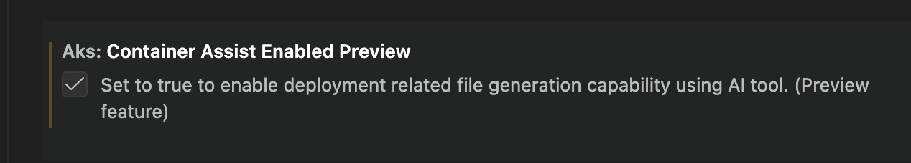

## Where you can launch it

Container Assist can be launched from:

- Explorer folder context menu: `AKS: Deploy application to AKS (Preview)`
- AKS cluster context menu: `AKS: Run Container Assist (Preview)`

The AKS cluster context menu entry is shown when:

- `aks.containerAssistEnabledPreview` is `true`
- At least one workspace folder is open

## User flow and options

After launch, you can select one or both actions:

- `Generate Deployment Files`
- `Generate GitHub Workflow`

### Azure context selection

Before generation begins, you are guided through Azure resource selection:

1. **Subscription** -- select your Azure subscription (skipped if launched from AKS cluster tree)
2. **AKS cluster** -- select the target cluster (skipped if launched from AKS cluster tree)
3. **Namespace** -- select or enter a Kubernetes namespace on the cluster
4. **Azure Container Registry** -- select an ACR from your subscription. If the ACR is not already attached to the cluster, you are prompted to assign the AcrPull role. See [Azure Resources and Permissions](./container-assist-azure-resources.md) for details.

### Deployment file generation

If `Generate Deployment Files` is selected, the flow analyzes your project and generates:

- `Dockerfile` at project root (or selected module path)
- Kubernetes manifests under your configured manifests folder (default: `k8s`)

The analysis detects your project's language, framework, ports, dependencies, and entry points. If existing Dockerfiles or manifests are found, the extension detects them and can enhance rather than overwrite. See [AI Data Flow and Privacy](./container-assist-ai-data-flow.md) for how AI models are used during generation.

### Workflow generation

If `Generate GitHub Workflow` is selected, a GitHub Actions CI/CD workflow is configured for the selected AKS/Azure context. See [GitHub Workflow and OIDC Setup](./container-assist-github-workflow.md) for details on the generated workflow.

If both actions are selected, deployment file generation runs first, then workflow generation.

## GitHub integration story

When generated files are ready, the post-generation flow is designed for PR-friendly collaboration:

1. OIDC setup prompt (when workflow is generated):
   - `Configure Pipeline with Managed Identity` -- creates Azure managed identity, federated credentials, role assignments, and sets GitHub secrets. See [GitHub Workflow and OIDC Setup](./container-assist-github-workflow.md#oidc-setup-process) for the full process and [Azure Resources and Permissions](./container-assist-azure-resources.md) for what is created.
   - `Skip`
2. Review prompt:
   - `Stage & Review`
   - `Open Files`
3. If you choose staging, files are staged and Source Control is focused with a suggested commit message.
4. After commit, you are prompted to create a pull request.
5. PR creation can run through the GitHub Pull Requests extension, with default branch and draft behavior from settings.

This supports a full path from local generation to reviewable GitHub PR with minimal manual glue steps.

## Configuration reference

`aks.containerAssistEnabledPreview`
: Enable/disable the Container Assist preview entry points.

`aks.containerAssist.k8sManifestFolder`
: Folder name for generated Kubernetes manifests. Default: `k8s`.

`aks.containerAssist.enableGitHubIntegration`
: Enables Git/GitHub integration in the post-generation flow.

`aks.containerAssist.promptForPullRequest`
: Reserved setting for PR prompting behavior.

`aks.containerAssist.prDefaultBranch`
: Default base branch for PRs. Default: `main`.

`aks.containerAssist.prCreateAsDraft`
: Create PRs as draft by default. Default: `true`.

`aks.containerAssist.modelFamily`
: Default model family used by Container Assist. Default: `gpt-5.2-codex`.

`aks.containerAssist.modelVendor`
: Default model vendor used by Container Assist. Default: `copilot`.

## Deployment annotations

The generated workflow annotates resources in your cluster after each deployment. These annotations use the `aks-project/` prefix, which is a shared schema read by both this extension and aks-desktop.

### Namespace annotations

Applied once per deployment run to the target namespace via `kubectl annotate namespace`:

| Annotation | Value | Description |
|---|---|---|
| `aks-project/workload-identity-id` | `${{ secrets.AZURE_CLIENT_ID }}` | Client ID of the managed identity used for workload identity federation. Stored on the namespace because identity config is per-namespace, not per-deployment. |
| `aks-project/workload-identity-tenant` | `${{ secrets.AZURE_TENANT_ID }}` | Azure AD tenant ID associated with the managed identity. |

### Deployment annotations

Applied to all deployments in the namespace via `kubectl annotate deployment --all`:

| Annotation | Value | Description |
|---|---|---|
| `aks-project/pipeline-repo` | `${{ github.repository }}` | The `owner/repo` of the GitHub repository that triggered the deployment. |
| `aks-project/pipeline-workflow` | `${{ github.workflow }}` | Name of the GitHub Actions workflow. |
| `aks-project/deployed-by` | `vscode` | Identifies the tool that generated and deployed this workflow. Recognized by aks-desktop for provenance display. |
| `aks-project/pipeline-run-url` | `${{ github.server_url }}/${{ github.repository }}/actions/runs/${{ github.run_id }}` | Direct link to the Actions run that produced this deployment. |

## Screenshots

### Menu entry points

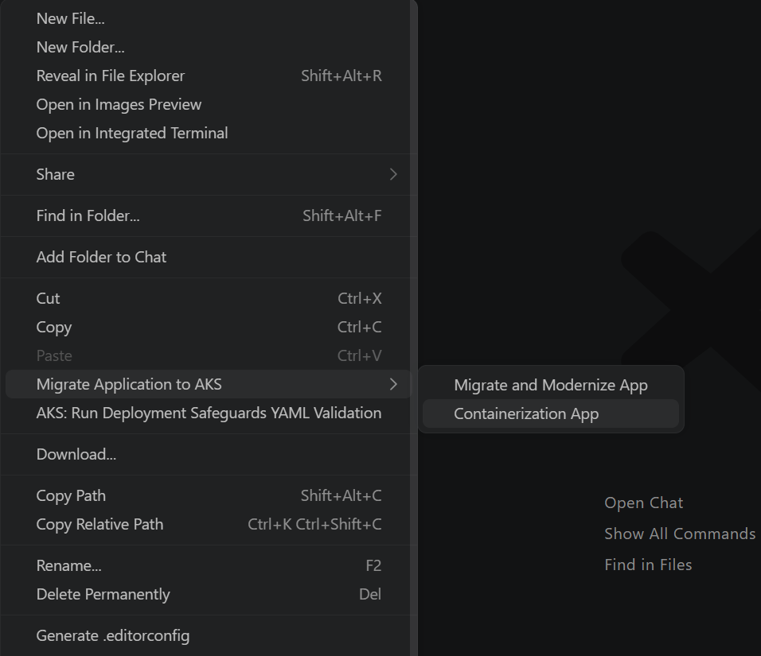

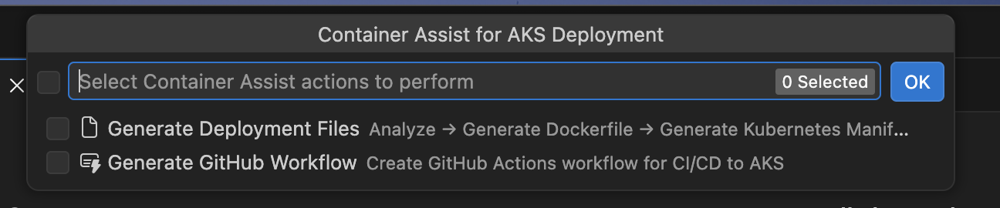

### Container Assist and GitHub integration flow

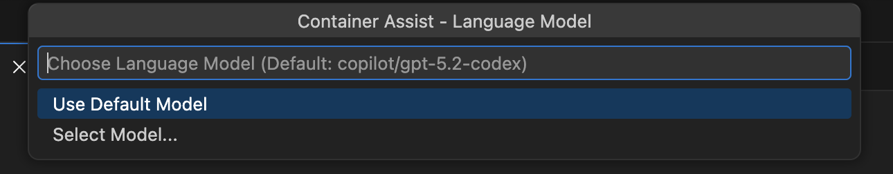

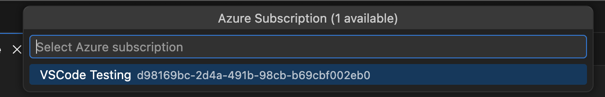

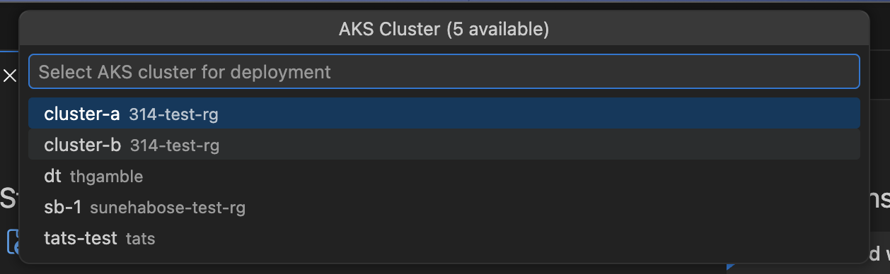

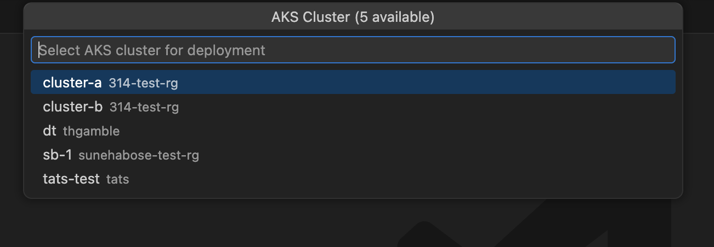

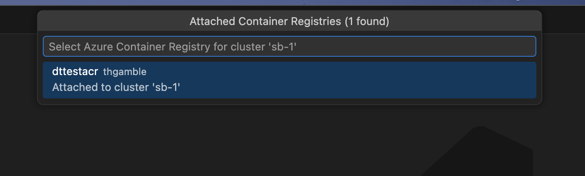

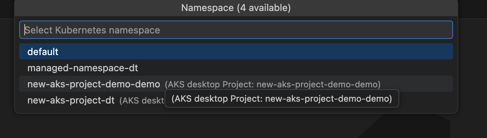

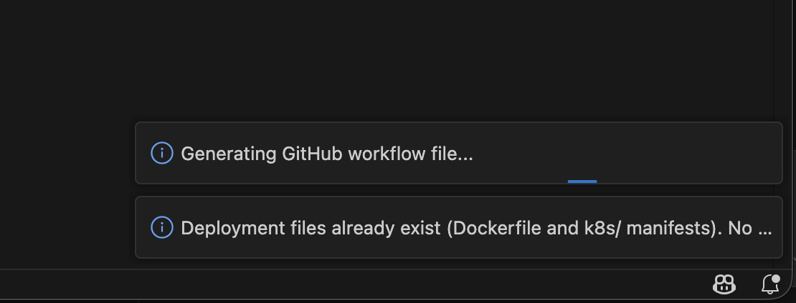

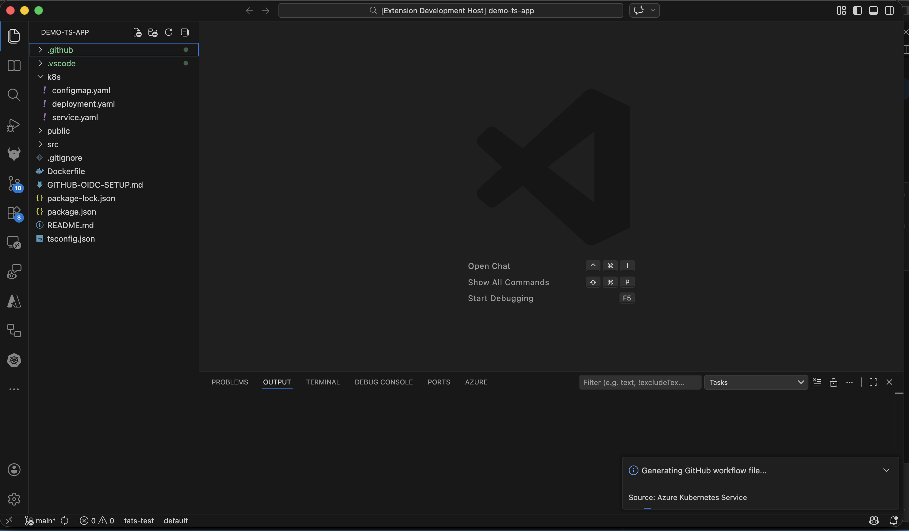

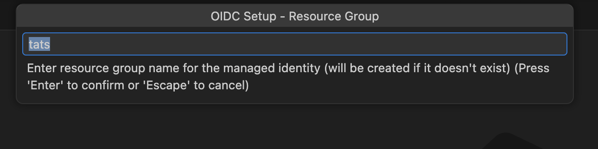

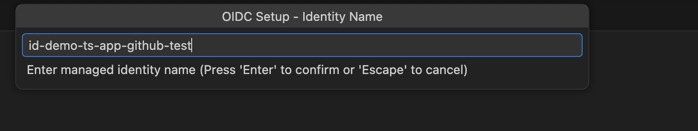

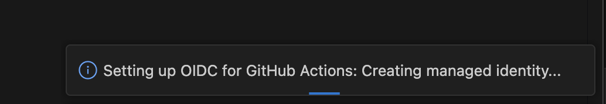

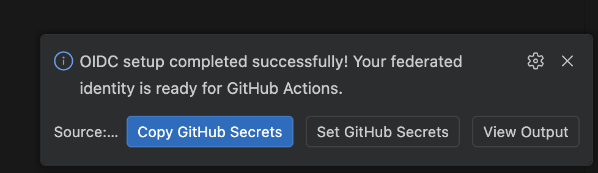

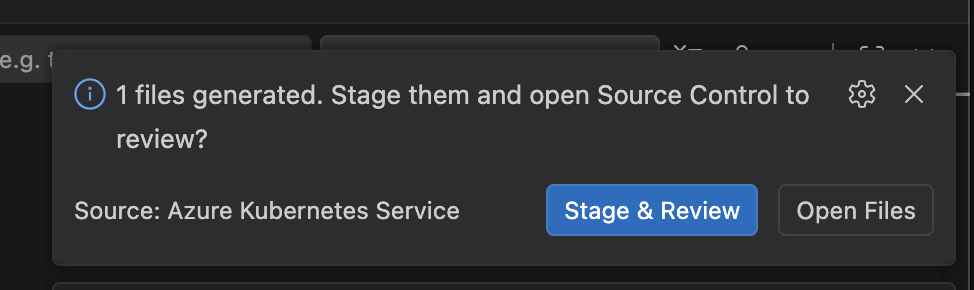

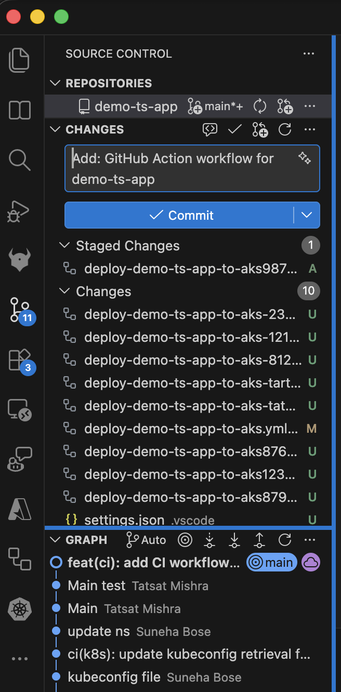

## Troubleshooting

### "No Language Model available"

Container Assist requires a language model provided by GitHub Copilot. If you see this error:

1. Install the [GitHub Copilot](https://marketplace.visualstudio.com/items?itemName=GitHub.copilot) extension.
2. Sign in with a GitHub account that has an active Copilot subscription.
3. Try launching Container Assist again.

If models are available but the preferred model (`gpt-5.2-codex` / `copilot` by default) is not found, the extension falls back to the first available model with a warning. You can change the preferred model via the `aks.containerAssist.modelFamily` and `aks.containerAssist.modelVendor` settings.

### OIDC setup fails with "SAML SSO required"

If your GitHub repository belongs to an organization that enforces SAML single sign-on, you must authorize your GitHub token for that organization before the extension can set repository secrets. When this happens, the extension shows an **Authorize Token** button that opens the SSO authorization page in your browser. Complete the authorization and retry.

### Some role assignments failed

During OIDC setup, role assignments are attempted individually. If some succeed and others fail, you see a warning listing the roles that could not be assigned. This can happen if:

- Your Azure account lacks sufficient permissions (you need `Microsoft.Authorization/roleAssignments/write` on the target scope).
- The target resource is locked or has a deny assignment.

The warning tells you which roles to assign manually. See [Azure Resources and Permissions](./container-assist-azure-resources.md) for the full list of roles and their scopes.

### Azure RBAC is not enabled on the cluster

When Azure RBAC is disabled on the AKS cluster, the extension skips the **AKS RBAC Writer** role assignment for standard (user) namespaces. This is expected behavior -- the role only applies to clusters with Azure RBAC enabled. ACR-related roles (AcrPush, Container Registry Tasks Contributor) are still assigned regardless.

For managed namespaces, AKS RBAC Writer is always assigned at namespace scope, regardless of the cluster-level Azure RBAC setting.

### Project type not detected

If Container Assist does not detect your project's language, ensure your workspace root contains one of the supported indicator files (see [Supported languages and project types](#supported-languages-and-project-types)). Projects classified as `other` may produce less accurate Dockerfile and manifest output.

### "GitHub authentication failed"

This error appears when the extension cannot obtain a GitHub token. Make sure:

1. You have a GitHub account with access to the target repository.
2. VS Code can authenticate with GitHub (the built-in GitHub Authentication provider should be available).
3. You grant the requested `repo` scope when prompted.

### Repository is archived or read-only

OIDC setup cannot set secrets on archived GitHub repositories. If you see a message about the repository being archived, you need to unarchive it first in GitHub settings, or set the required secrets manually.

### Partial secrets set

If some GitHub secrets were set but others failed, the extension reports which secrets could not be written. You can set the missing secrets manually in your repository's **Settings > Secrets and variables > Actions** page. The required secrets are:

- `AZURE_CLIENT_ID` -- client ID of the managed identity
- `AZURE_TENANT_ID` -- Azure AD tenant ID
- `AZURE_SUBSCRIPTION_ID` -- Azure subscription ID

See [GitHub Workflow and OIDC Setup](./container-assist-github-workflow.md) for details on how these secrets are used in the workflow.

### No Azure subscriptions found

If the extension shows a warning about no subscriptions, verify that:

1. You are signed in to Azure in VS Code.
2. Your Azure account has at least one active subscription.
3. The subscription filter in the Azure extension is not hiding your subscriptions.
