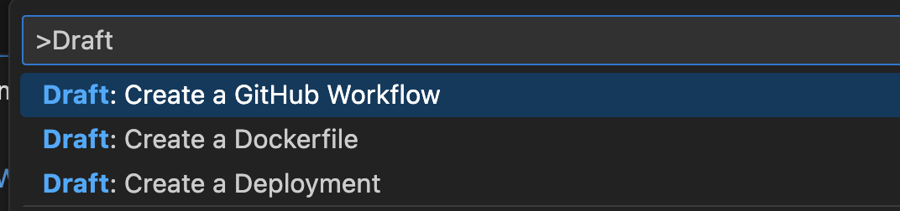
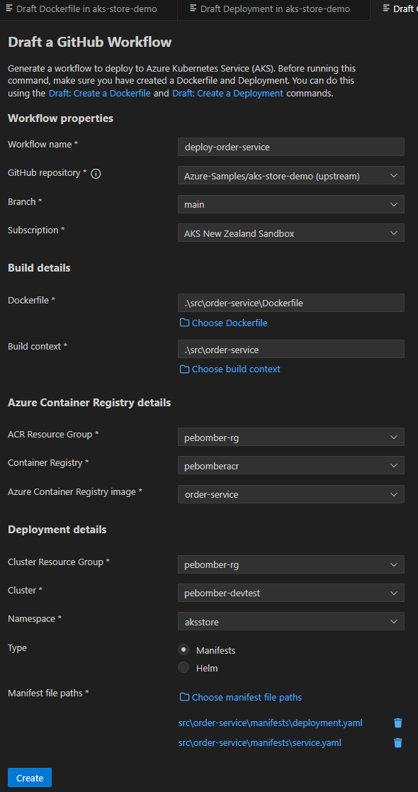

# Deployment Tools: Draft Tool Integration

The extension bundles the [Draft](https://github.com/Azure/draft) tool to scaffold
deployment assets for your project. The pinned version is set by the
`aks.drafttool.releaseTag` setting, currently `v0.17.14`. See
[Pinned versions](../reference/pinned-versions.md).

## Available commands

| Command | Where |
|---|---|
| **AKS: Create a GitHub Workflow** | Command Palette, and cluster > **Develop & Deploy** |
| **AKS: Run Deployment Safeguards YAML Validation** | Command Palette, cluster > **Develop & Deploy**, and the Explorer context menu on a folder or YAML file |
| **AKS: Create Argo CD GitOps Pipeline** | Command Palette, when `aks.argoCDEnabled` is on. See [Argo CD GitOps Integration](./argocd-gitops-integration.md) |

Creating a GitHub workflow requires an open workspace folder.

## Create a GitHub Workflow

Generates a starter GitHub Actions workflow, pre-populated with the selected cluster and
resource names, for deploying to AKS with either Helm or Kubernetes manifests.

## Run Deployment Safeguards YAML Validation

Validates Kubernetes manifests against
[Deployment Safeguards](https://learn.microsoft.com/azure/aks/deployment-safeguards)
and reports findings, so you can catch policy violations before applying them to a cluster.

## Generating Dockerfiles and manifests

To scaffold a Dockerfile and Kubernetes manifests for an application, use
[Container Assist](./container-assist-integration.md), which supersedes the standalone
Draft scaffolding commands.
