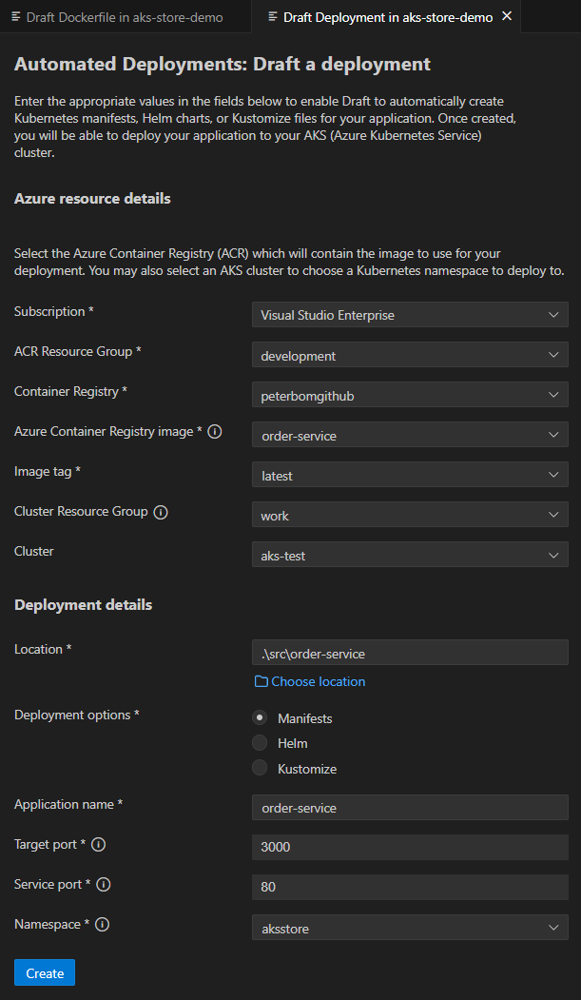
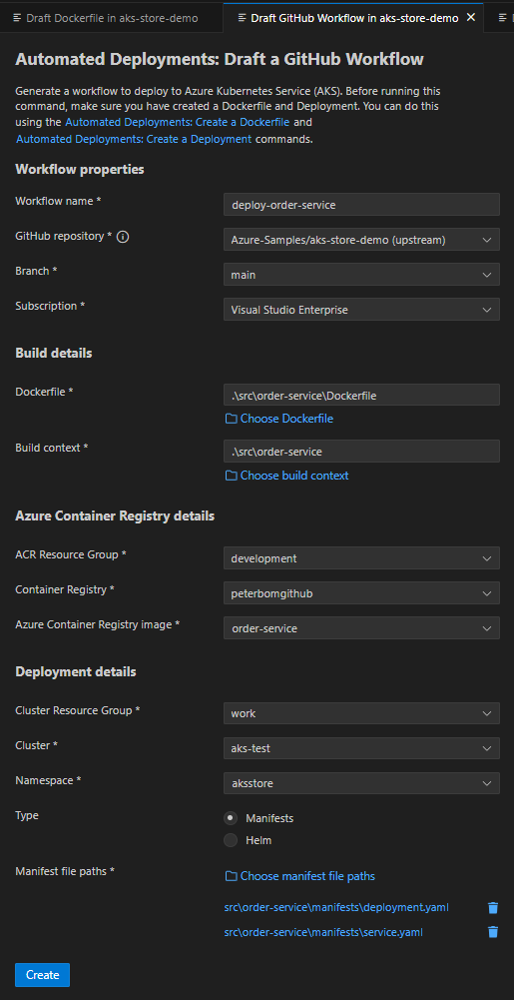

# Automated Deployments: Draft Tool Integration

The Automated Deployments commands integrate the Draft tool to provide:

- Draft Dockerfile
- Draft Deployment
- Draft Workflow

These can be launched from either:

- The command palette. (To open: Hold `Ctrl` (`⌘ Cmd` on macOS) + `shift` + `p` )

This will allow user to have access to a complete power of Draft tool and allow users to take advantage for scaffolding geenration for their projects.

