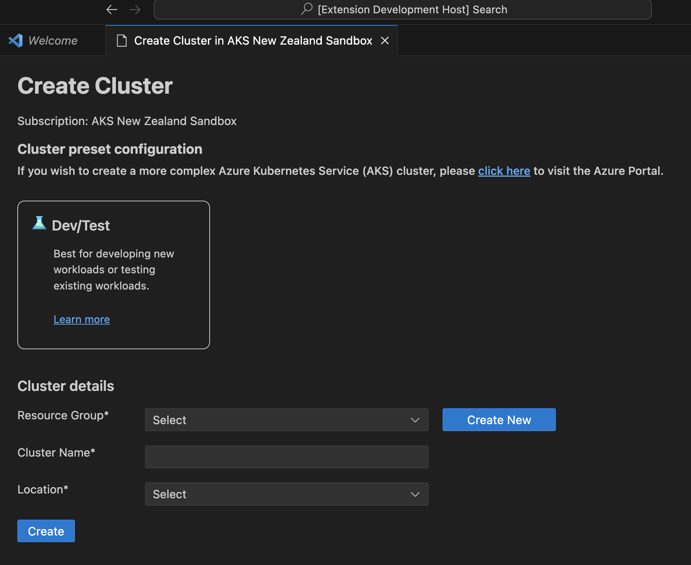

## Features

Once you successfully log in with your Azure Account, you can view all AKS clusters in your Azure subscriptions(s) under the section named **Azure**. You can right click on your AKS cluster and click a menu item to perform following actions.  

