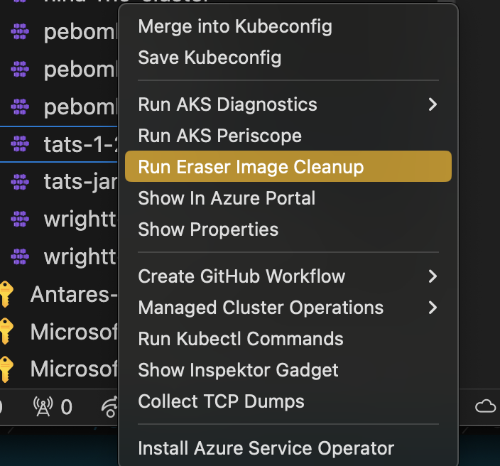
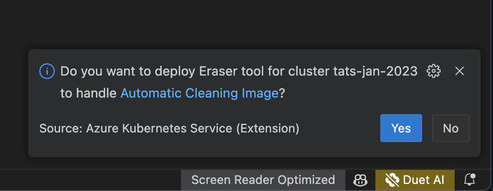

# Garbage collection Using Eraser Image Cleanup Tool

### Run Eraser Image Cleanup

Right click on your AKS cluster and select **Run Eraser Image Cleanup** to deploy the [Eraser Tool](https://eraser-dev.github.io/eraser/docs/quick-start) to [auomatically clean images in a regular interval](https://eraser-dev.github.io/eraser/docs/quick-start#automatically-cleaning-images) for the selected AKS Cluster.

