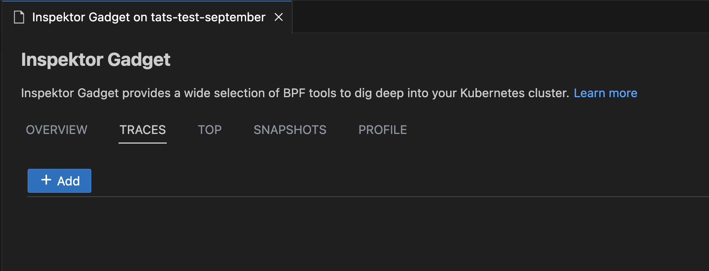
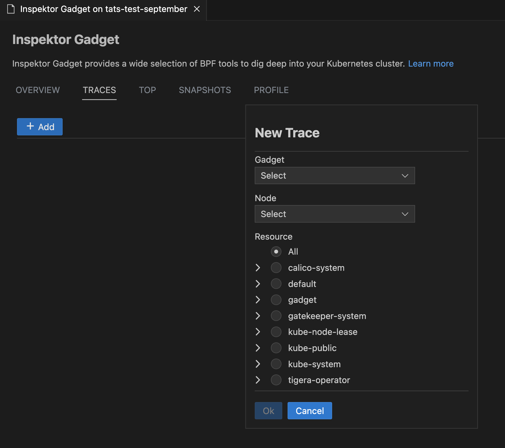

### Inspektor Gadget

### Deploy and Undeploy InspektorGadget

Right click on your AKS cluster and select **Troubleshoot Network Health** and then click on **Show Inspektor Gadget** to easily deploy gadget into your cluster. User can easily one-click deploy and undeploy gadget from this feature.

### Profile, Top, Trace and Snapshot Inspektor Gadget Commands

Right-click on your AKS cluster and select **Show Inspektor Gadget** and choose **Gadget Commands** to easily use non-interactive Top, Trace, Profile or Snapshot commands for your cluster.

