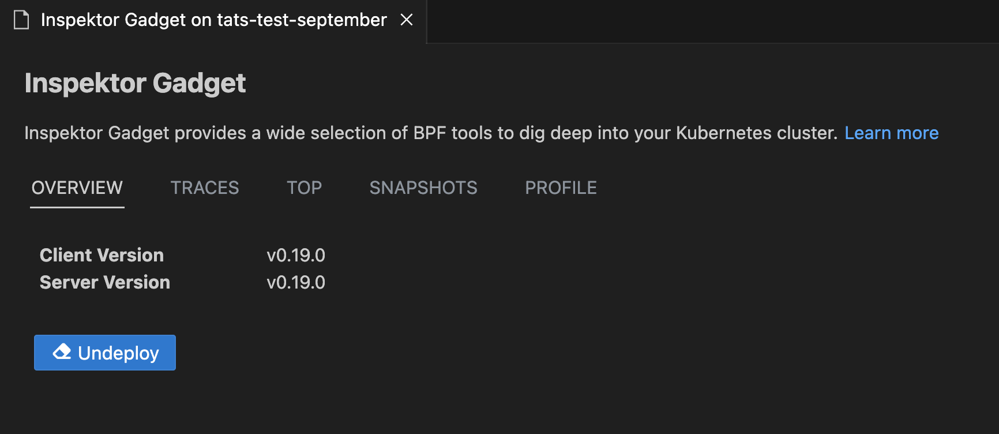
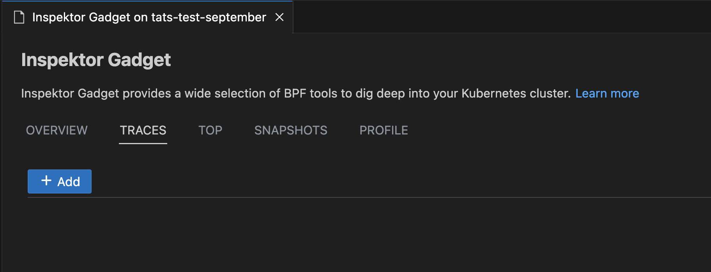
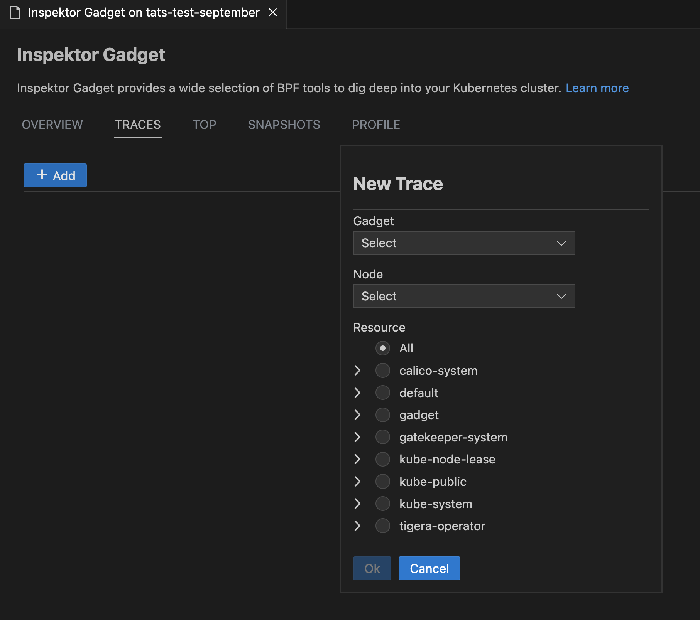
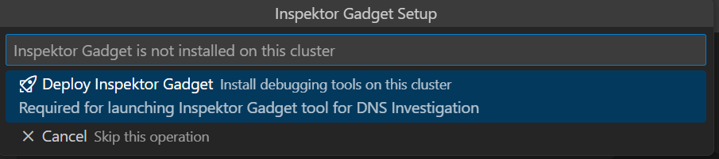
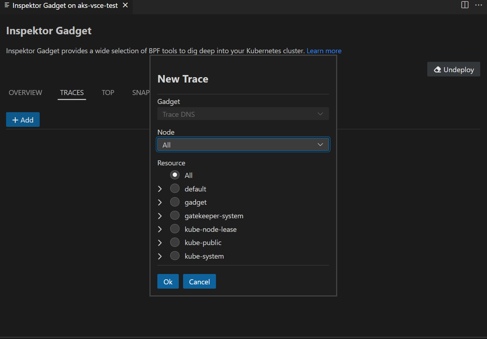
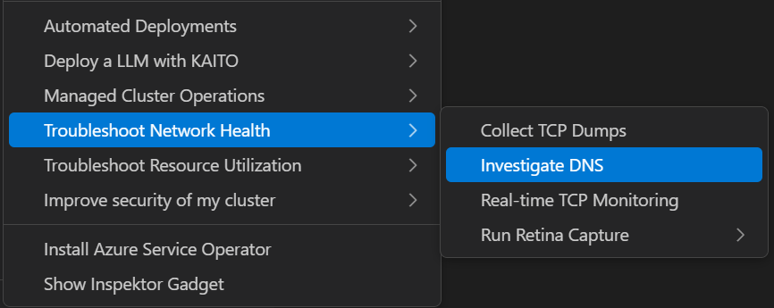
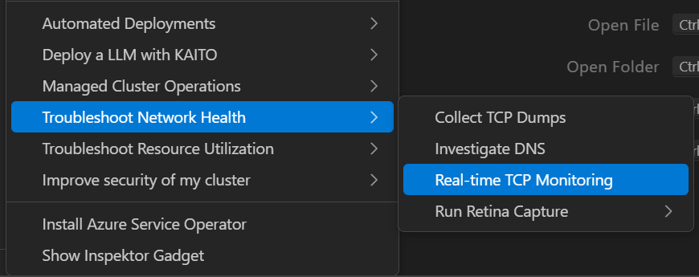
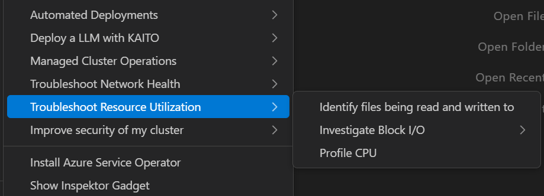
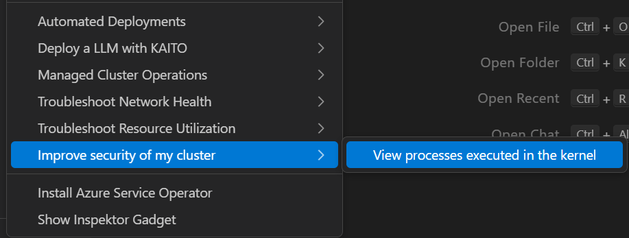

# Inspektor Gadget

## Deploy and Undeploy InspektorGadget

Right-click your AKS cluster > **Troubleshoot & Diagnose** > **Show Inspektor Gadget** to deploy the gadget into your cluster. You can deploy and undeploy the gadget from this page.

## Profile, Top, Trace and Snapshot Inspektor Gadget Commands

Right-click your AKS cluster > **Troubleshoot & Diagnose** > **Show Inspektor Gadget**, then choose **Gadget Commands** to use non-interactive Top, Trace, Profile or Snapshot commands for your cluster.

## Shortcuts for common troubleshooting scenarios

Alongside the general gadget commands, the menu offers shortcuts for the problems you
are most likely to be investigating. If Inspektor Gadget is not yet deployed to the
cluster, the extension offers to deploy it first.

Depending on the context, the appropriate gadget will be selected automatically and the gadget dialog will open with the relevant options.

## Investigate DNS
Right-click your AKS cluster > **Troubleshoot & Diagnose** > **Troubleshoot Network Health** > **Investigate DNS** to troubleshoot DNS-related issues in your cluster. This provides specialized tools for monitoring DNS queries and identifying connectivity problems.

## Real-time TCP Monitoring
Right-click your AKS cluster > **Troubleshoot & Diagnose** > **Troubleshoot Network Health** > **Real-time TCP Monitoring** to monitor TCP connections and network traffic in real-time. This helps identify network bottlenecks and connection issues.

## Troubleshoot Resource Utilization
Right-click your AKS cluster > **Troubleshoot & Diagnose** > **Troubleshoot Resource Utilization** to analyze CPU, memory, and other resource usage patterns across your cluster. This helps identify resource constraints and optimization opportunities.

The Troubleshoot Resource Utilization menu includes the following sub-options:

- **Identify files being read and written to**: Monitor file system operations to understand which processes are accessing specific files.
- **Investigate Block I/O**: a submenu containing **Identify Block I/O intensive processes**, which detects processes with high disk usage to identify potential performance bottlenecks.
- **Profile CPU**: Take samples of stack traces to analyze performance issues and identify resource-intensive processes.

## Improve security of my cluster
Right-click your AKS cluster > **Troubleshoot & Diagnose** > **Improve security of my cluster** > **View processes executed in the kernel** to use the `trace_exec` gadget under the hood to monitor when new processes are executed.

