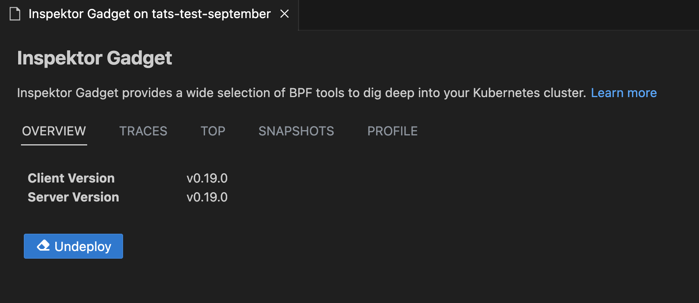

### Inspektor Gadget

### Deploy and Undeploy InspektorGadget

Right click on your AKS cluster and select **Show Inspektor Gadget** to easily deploy gadget into your cluster. The Show Inspektor Gadget command has been moved to the main context menu for easier access. Users can easily one-click deploy and undeploy gadget from this feature.

### Profile, Top, Trace and Snapshot Inspektor Gadget Commands

Right-click on your AKS cluster and select **Show Inspektor Gadget** and choose **Gadget Commands** to easily use non-interactive Top, Trace, Profile or Snapshot commands for your cluster.

### New Troubleshooting Menu Items

The Inspektor Gadget integration now includes specialized menu items for common troubleshooting scenarios. If Inspektor Gadget is not deployed, the extension will prompt you to deploy it as below.

Depending on the context, the appropriate gadget will be selected automatically and the gadget dialog will open with the relevant options.

### Investigate DNS
Right-click on your AKS cluster and select **Investigate DNS** to troubleshoot DNS-related issues in your cluster. This provides specialized tools for monitoring DNS queries and identifying connectivity problems.

### Real-time TCP Monitoring
Select **Real-time TCP Monitoring** to monitor TCP connections and network traffic in real-time. This helps identify network bottlenecks and connection issues.

### Troubleshoot Resource Utilization
Use **Troubleshoot Resource Utilization** to analyze CPU, memory, and other resource usage patterns across your cluster. This helps identify resource constraints and optimization opportunities.

The Troubleshoot Resource Utilization menu includes the following sub-options:

- **Identify files being read and written to**: Monitor file system operations to understand which processes are accessing specific files.
- **Investigate Block I/O intensive processes**: Detect processes with high disk usage to identify potential performance bottlenecks.
- **Profile CPU**: Take samples of stack traces to analyze performance issues and identify resource-intensive processes.

### Improve Security of My Cluster
Select **Improve Security of My Cluster** to access the `trace_exec` gadget under the hood to monitor when new processes are executed.

