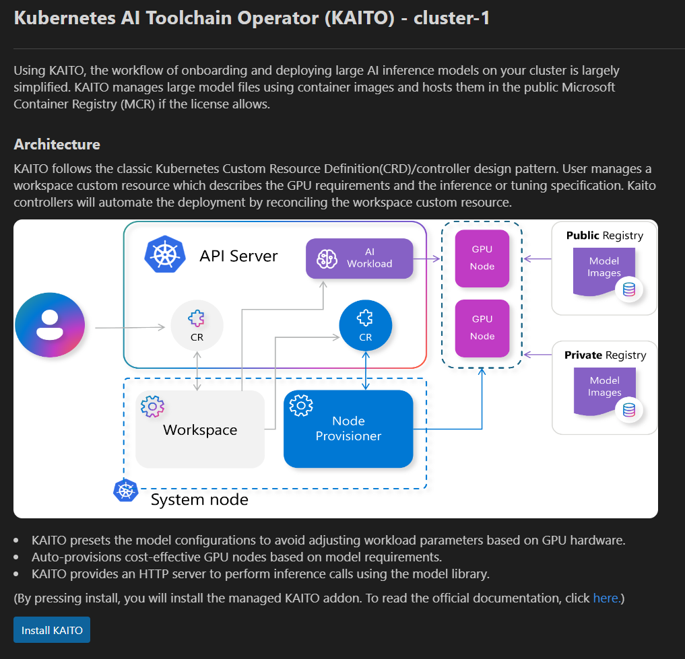
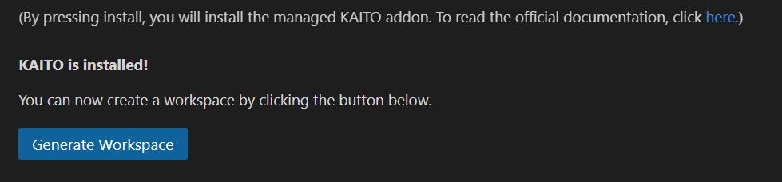
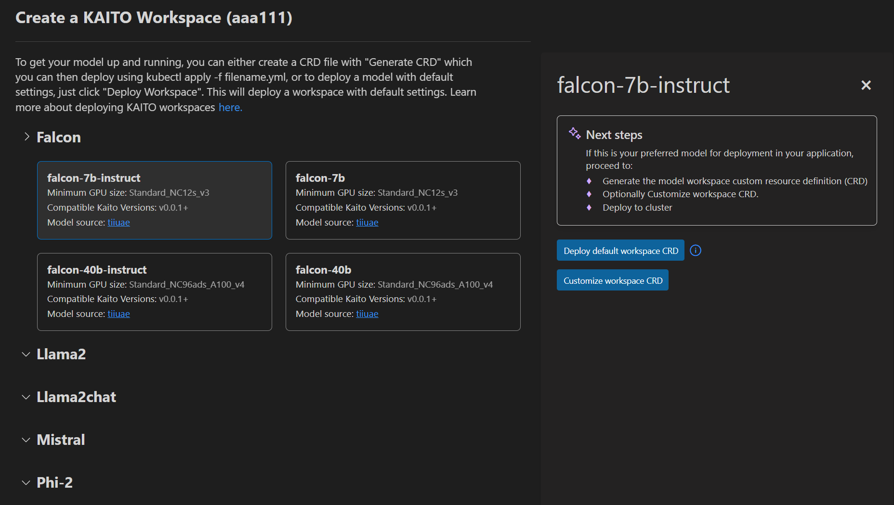
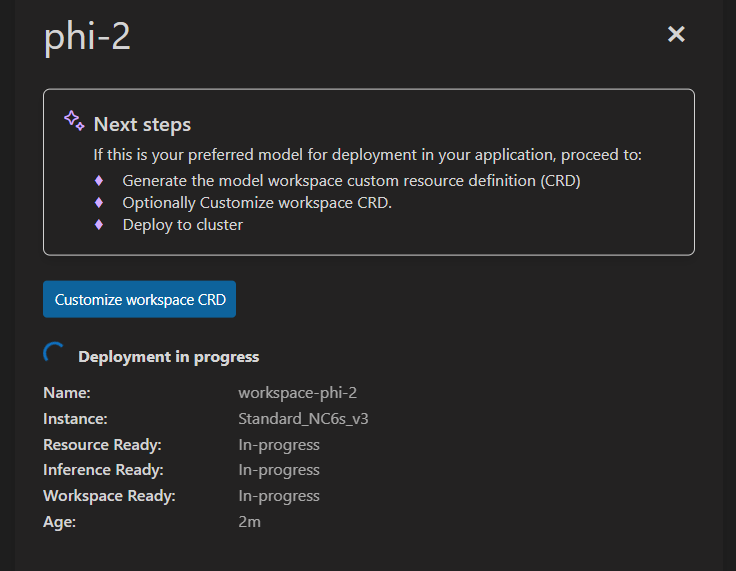
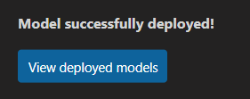

# Install and Deploy KAITO models

The KAITO integration enables seamless installation of KAITO onto your clusters, empowering you to deploy AI models, manage workflows, and test deployments with ease and precision.

### Install KAITO

Right click on your desired AKS cluster and select **Deploy an LLM with KAITO** and then click on **Install KAITO** to open up the KAITO installation page. 

Once on the page, click **Install KAITO** and the KAITO installation process will begin. Once KAITO has been successfully installed, you will be prompted with a "Generate Workspace" button that will redirect you to the model deployment page.

### Deploy a model

Right click on an AKS cluster that has KAITO successfully installed and select **Deploy an LLM with KAITO** and then click on **Create KAITO Workspace** to open the KAITO model deployment page.

Once on this page, you can click any of the models to open up the side panel, which will present you with the option to either **Deploy Default workspace CRD** or **Customize Workspace CRD**. 

Click **Deploy Default workspace CRD** to deploy the model. It will track the progress of the model and notify you once the model has been successfully deployed. It will also notify you if the model was already previously unsucessfully onto your cluster. Upon successful deployment, you will be prompted with a "View Deployed Models" button that will redirect you to the deployment management page.

Click **Customize Workspace CRD** to open up a CRD file pre-populated with the infromation necessary to deploy the model. You can alter this file to your desires and save it locally. 