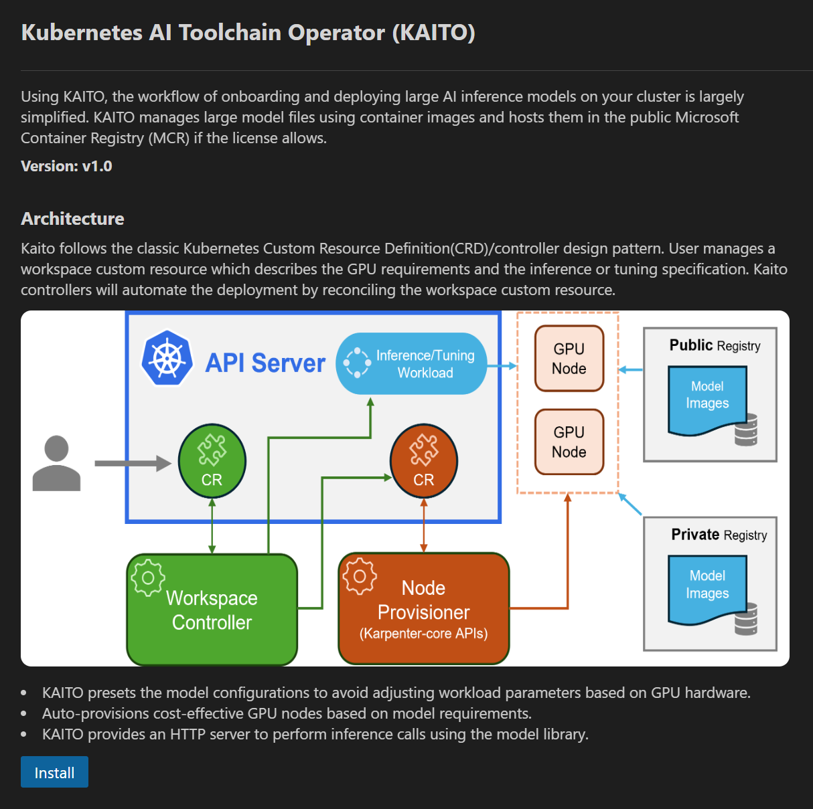

# Install and deploy KAITO models

The KAITO integration allows you to

- Install KAITO to a cluster
- Deploy KAITO models

### Install KAITO

Right click on your AKS cluster and select **Deploy an LLM with KAITO** and then click on **Install KAITO** to open up the KAITO installation page. 

Once on the page, click **Install** and the KAITO installation progress will begin. You will be notified when KAITO has been successfully installed. 

### Deploy a model

Right click on an AKS cluster that has KAITO installed and select **Deploy an LLM with KAITO** and then click on **Create KAITO Workspace** to open the KAITO model deployment page.

Once on this page, you can click any of the models to open up the side panel, which will present you with the option to either **Deploy Default workspace CRD** or **Customize Workspace CRD**. 

Click **Deploy Default workspace CRD** to deploy the model. It will track the progress of the model and notify you once the model has been successfully deployed. It will also notify you if the model was already previously unsucessfully onto your cluster.

Click **Customize Workspace CRD** to open up a CRD file pre-populated with the infromation necessary to deploy the model. You can alter this file to your desires and save it locally. 