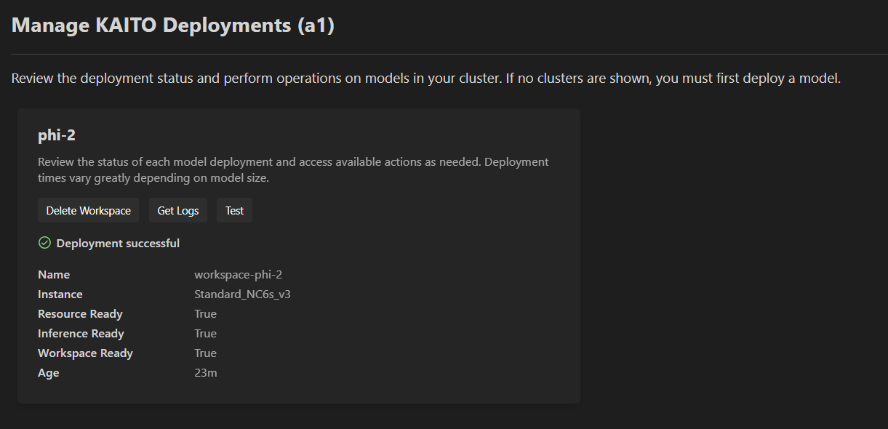
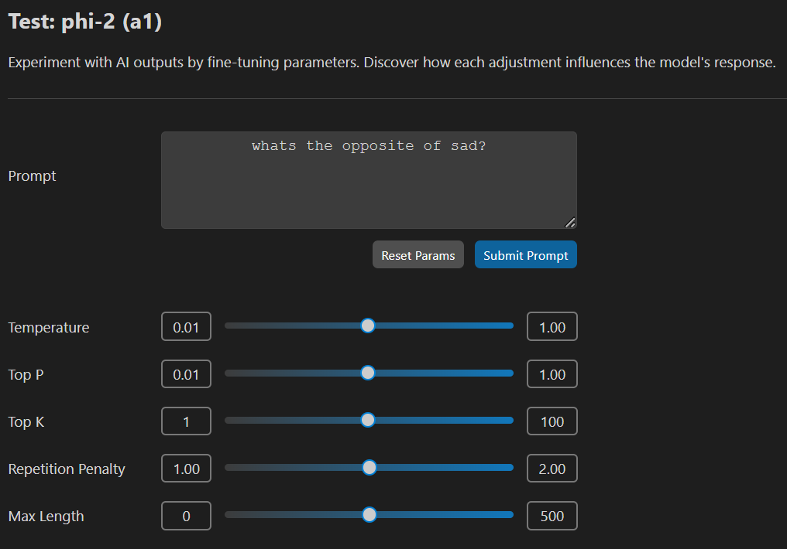

# Manage and Test KAITO Deployments

Actively monitor the the status of all KAITO deployments on the cluster, retrieve logs, test the inference servers, and delete/redeploy models.

### Manage KAITO Deployments

Right click on your desired AKS cluster and select **Deploy an LLM with KAITO** and then click on **Manage KAITO Models**.

Once on this page, you will see all existing KAITO deployments on the cluster, alongside their status (ongoing, successful, or failed).

For your selected deployment, click **Get Logs** to  access the latest logs from the KAITO workspace pods. This action will generate a new text file containing the most recent 500 lines of logs.

To delete a model, select **Delete Workspace** (or **Cancel** for ongoing deployments). For failed deployments, choose **Re-deploy Default CRD** to remove the current deployment and restart the model deployment process from scratch.

### Test a Model

On your desired model, select **Test** to access the model testing page.

Once on the testing page, you can modify the parameters and enter a prompt for submsission. Click **Reset Params** to reset all configurable parameters to their default values. Click **Submit Prompt** to submit your query.

