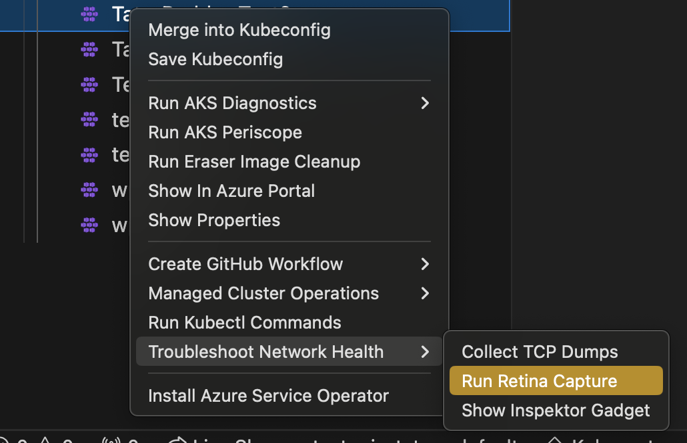
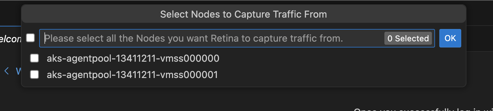
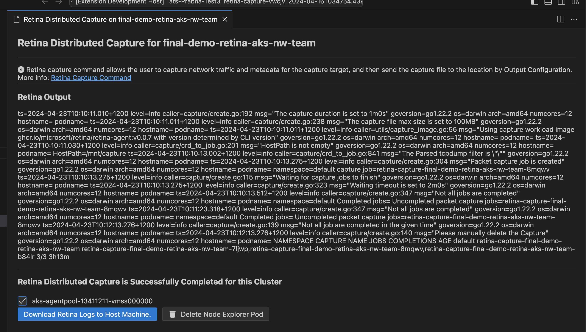

# Run Retina Distributed Capture from AKS Cluster Linux Nodes

### Run Retina Capture

Right click on your AKS cluster and select **Troubleshoot Network Health** and then click on **Run Retina Capture** to capture logs like iptables-rules, [ip-resrouces.txt and other key distributed captures form this azure networking tool](https://retina.sh/docs/captures/cli#file-and-directory-structure-inside-the-tarball) for any Linux node and download them to your local machine with ease.

