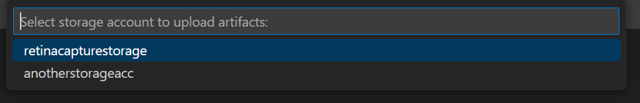

# Run Retina Distributed Capture from AKS Cluster Linux Nodes

## Run Retina Capture

Right click on your AKS cluster and select **Troubleshoot Network Health** and then click on **Run Retina Capture** to capture logs like iptables-rules, [ip-resrouces.txt and other key distributed captures form this azure networking tool](https://retina.sh/docs/captures/cli#file-and-directory-structure-inside-the-tarball) for any Linux nodes in yout AKS cluster.

There are two options to run the capture:

### Download the capture locally

### Upload the capture to Azure Storage

Before uploading the capture to Azure Storage, ensure the following prerequisites are met:

1. A storage account exists in the same region as your AKS cluster.

2. The storage account is configured in the Diagnostic settings of your AKS cluster.

3. A container is created within the storage account to store the capture.

