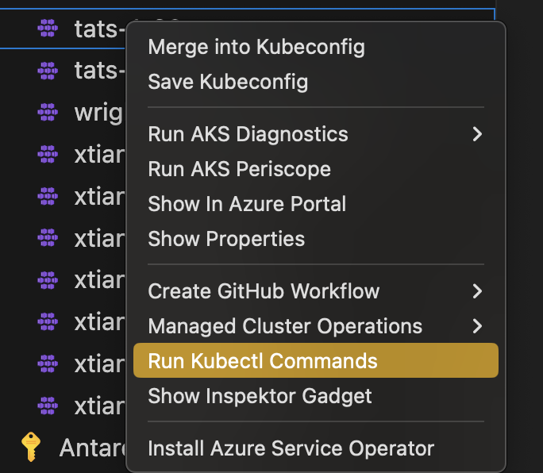
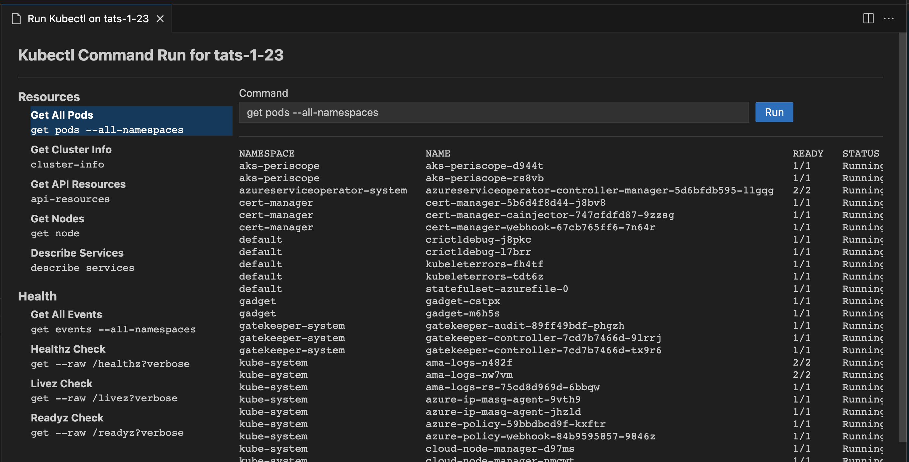

# Run Kubectl Commands

## Run Kubectl Commands from your AKS cluster

Right-click your AKS cluster > **Develop & Deploy** > **Run Kubectl Commands** to run common kubectl commands against your cluster. The panel groups them into two sections.

**Resources**

| Command | Runs |
|---|---|
| Get All Pods | `get pods --all-namespaces` |
| Get Cluster Info | `cluster-info` |
| Get API Resources | `api-resources` |
| Get Nodes | `get node` |
| Describe Services | `describe services` |

**Health**

| Command | Runs |
|---|---|
| Get All Events | `get events --all-namespaces` |
| Healthz Check | `get --raw /healthz?verbose` |
| Livez Check | `get --raw /livez?verbose` |
| Readyz Check | `get --raw /readyz?verbose` |

User can also run custom commands by typing or editing `kubectl` command parameters in the text field. Custom commands can optionally be saved for future use..

