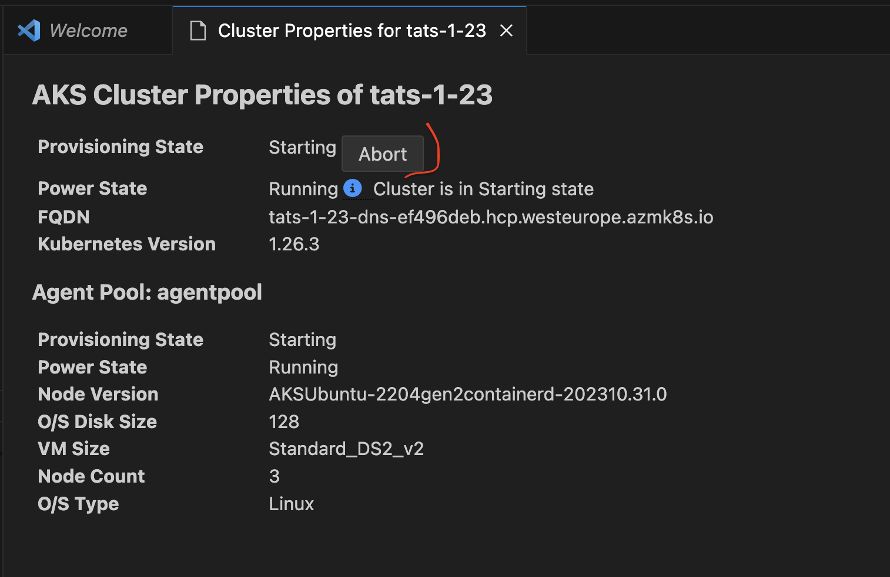
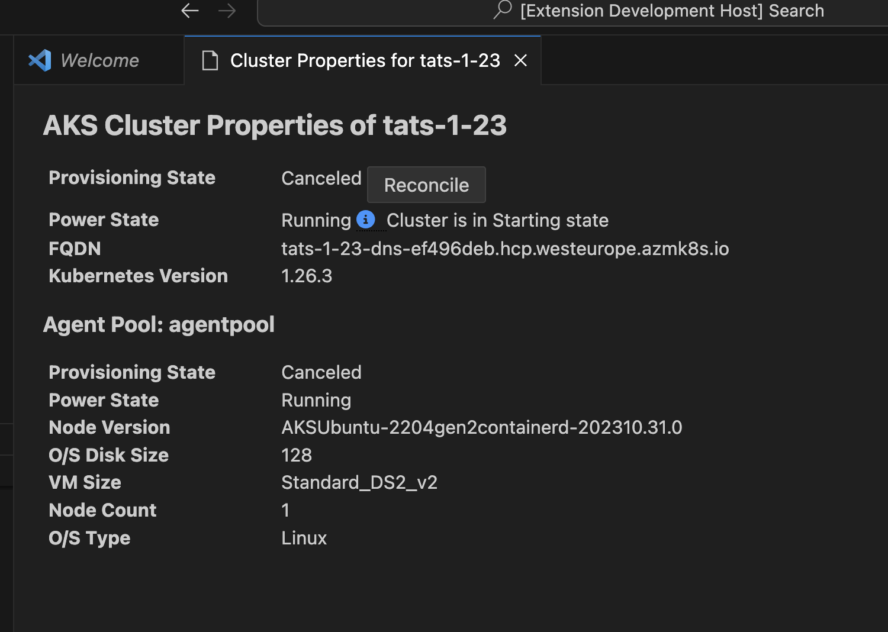
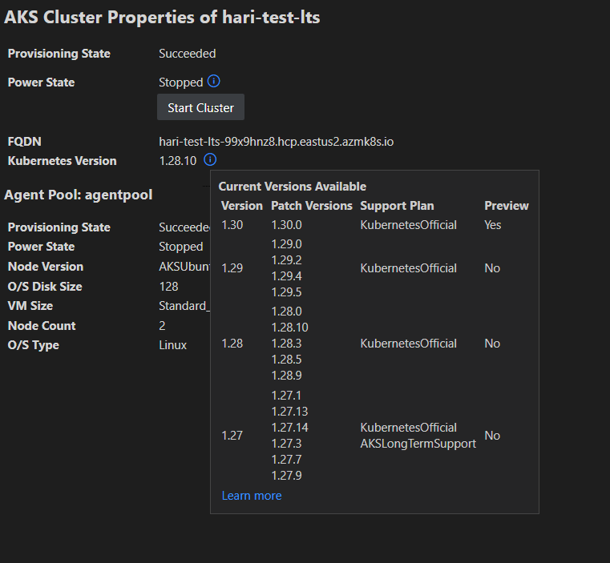
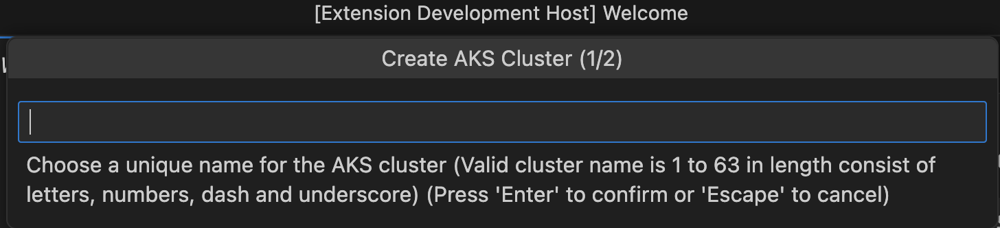
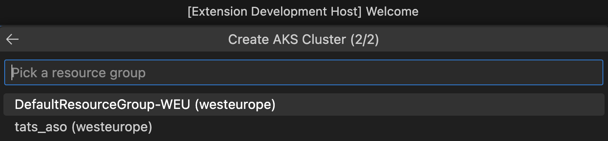
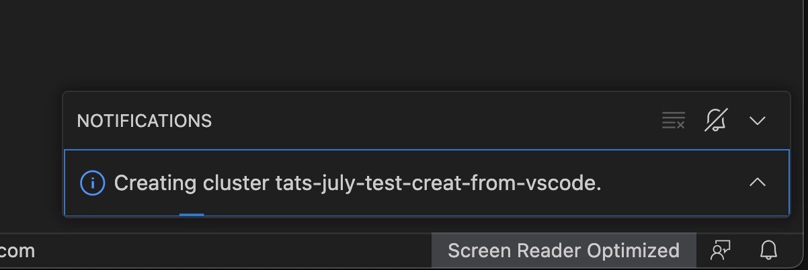
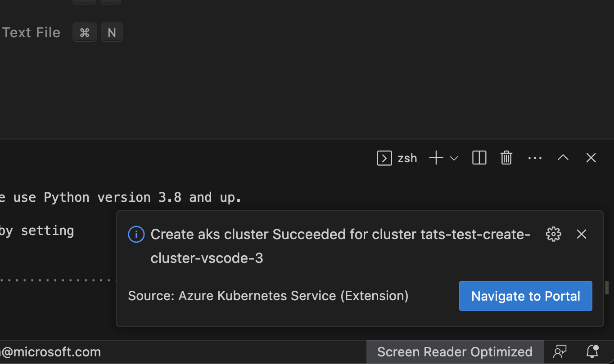
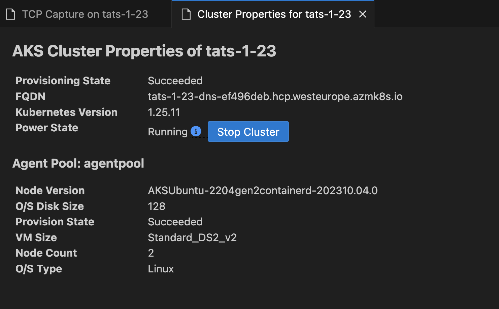

# Show Properties, Show in Azure Portal

### Show in Azure Portal

Right click on your AKS cluster and click on **Show in Azure Portal** to easily navigate to AKS cluster overview page in Azure Portal.

### Show Properties

Right click on your AKS cluster and click on **Show Properties** to display the AKS cluster and agent pool properties like provisioning state, fqdn, k8s version, along with node properties like node version, vm type, vm size, o/s type, o/s disk size and nodes provisioning state.

This page also enables some useful cluster and node pool level operations like `Abort Last Operation` (at cluster and agent pool level) and `Reconcile`.

This page now also enable information box for the users to quickly see available kuberentes versions available for the cluster to upgrade and if the current version is out of support or not.

### Create cluster from Azure Portal

Right click on your AKS sunscription and click on **Create cluster from Azure Portal** to easily navigate to AKS create cluster page in Azure Portal.

### Create cluster

Right click on your AKS subscription and click on **Create Cluster** and select **Create Standard Cluster** which will start a 2-step wizard for you to enter a valid cluster name and select an existing resource group. The VS Code experience will then notify user with the deployment progress and present you with the **Navigate to Portal** link when it completes successfully.

### Start or Stop AKS cluster

Right click on your AKS cluster and click on **Show Properties** to display the AKS cluster properties, within the page there will be **Stop/Start Cluster** button to perform the start or stop the cluster operation.

