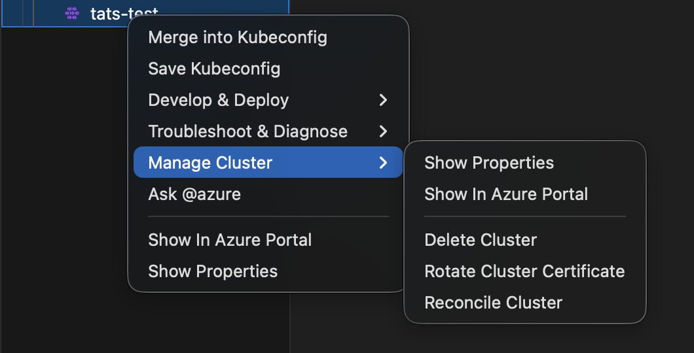

# Simplified AKS Menu Structure

The AKS extension uses a role-based cluster context menu organization as the default experience.

## Setting

```json
{
  "aks.simplifiedMenuStructure": true
}
```

Default value: `true`

After changing this setting, reload the VS Code window. You can also switch modes via the commands **AKS: Take me back to Classic Menu** and **AKS: Switch to Grouped Menu** without editing settings directly.

## What changes when enabled

Instead of many top-level commands, cluster actions are grouped into three submenus:

- `Develop & Deploy`
- `Troubleshoot & Diagnose`
- `Manage Cluster`

Direct commands `Show In Azure Portal` and `Show Properties` remain available.

## Menu grouping overview

`Develop & Deploy`
: Run Kubectl commands, Container Assist (preview), Attach ACR, Create GitHub Workflow, KAITO submenu, Install Azure Service Operator.

`Troubleshoot & Diagnose`
: AKS Diagnostics submenu, Inspektor Gadget, network troubleshooting submenu, resource utilization submenu, Eraser Tool, security submenu.

`Manage Cluster`
: Show properties, show in portal, delete cluster, rotate certificate, reconcile cluster.

## Container Assist in the new menu

When both feature flags are enabled:

- `aks.simplifiedMenuStructure = true`
- `aks.containerAssistEnabledPreview = true`

and a workspace folder is open, `AKS: Run Container Assist (Preview)` appears under `Develop & Deploy`.

## Switching between Classic and Grouped menus

Two commands let you switch menu modes without opening Settings:

| Command | Effect |
|---------|--------|
| **AKS: Take me back to Classic Menu** | Sets `aks.simplifiedMenuStructure` to `false` and prompts to reload. |
| **AKS: Switch to Grouped Menu** | Sets `aks.simplifiedMenuStructure` to `true` and prompts to reload. |

Both commands are available in:

- The **Command Palette** (`Cmd+Shift+P` / `Ctrl+Shift+P`).
- The **AKS cluster context menu** (right-click on a cluster in the Azure/Kubernetes Cloud Explorer).  
  Only the applicable command is shown — if the grouped menu is active you see "Take me back to Classic Menu", and vice versa.

After running either command, VS Code prompts you to reload the window. The new menu layout takes effect after the reload.

## Backward compatibility

When `aks.simplifiedMenuStructure` is `false`, the previous menu organization stays active.
This allows gradual rollout, internal validation, and user feedback collection without breaking existing workflows.

## Suggested rollout plan

1. Keep default `false` for broad compatibility.
2. Enable in dogfood or preview cohorts.
3. Collect feedback on discoverability and click depth.
4. Promote to default once validated.

## Screenshots





