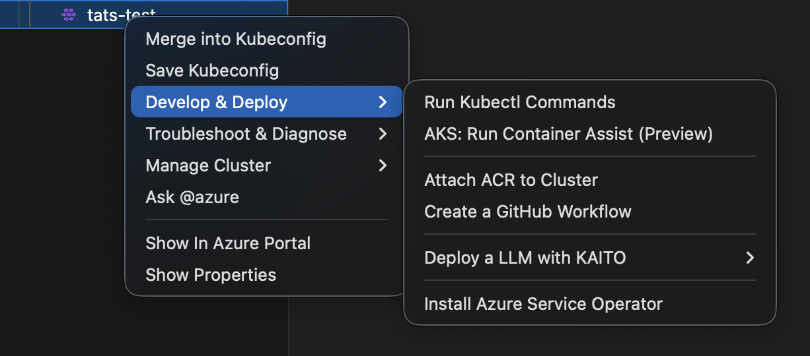
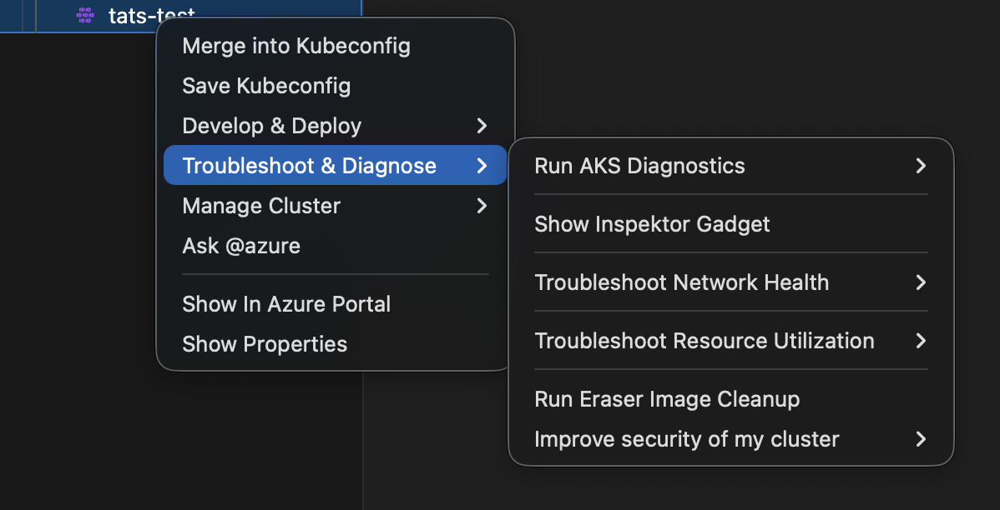
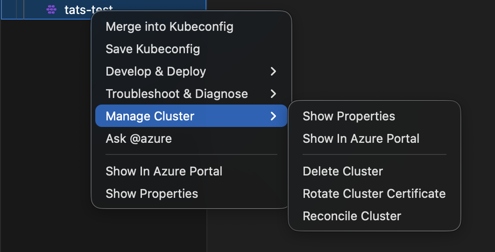
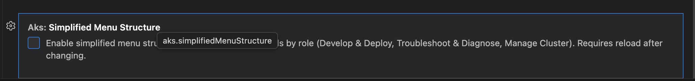

# Simplified AKS Menu Structure

When you right-click an AKS cluster, the commands are grouped by the kind of task you
are doing rather than listed all at once. This is how the menu behaves by default.

If you preferred the old flat list, run **AKS: Switch to Classic Menu** — see
[Switching between Classic and Grouped menus](#switching-between-classic-and-grouped-menus).

## How commands are grouped

Rather than one long list of top-level commands, cluster actions sit in three submenus:

- `Develop & Deploy`
- `Troubleshoot & Diagnose`
- `Manage Cluster`

These stay top-level: `Show In Azure Portal`, `Show Properties`, `AKS Quick Actions`, and `Switch to Classic Menu`.

## Menu grouping overview

`Develop & Deploy`
: Run Kubectl Commands, Attach ACR to Cluster, Create a GitHub Workflow, Run Deployment Safeguards YAML Validation, Install Azure Service Operator, the **Deploy a LLM with KAITO** submenu, Check Argo CD Status (with `aks.argoCDEnabled`), and the Container Assist commands (with `aks.containerAssistEnabledPreview`).

`Troubleshoot & Diagnose`
: The **Run AKS Diagnostics**, **Troubleshoot Network Health**, **Troubleshoot Resource Utilization**, and **Improve security of my cluster** submenus, plus Show Inspektor Gadget and Run Eraser Image Cleanup.

`Manage Cluster`
: Show Properties, Show In Azure Portal, Delete Cluster, Rotate Cluster Certificate, Reconcile Cluster.

## Where the Container Assist commands appear

With `aks.containerAssistEnabledPreview` enabled (the default), `AKS: Migrate Application to AKS` appears under `Develop & Deploy`. With a workspace folder also open, `AKS: Generate Dockerfiles and K8s Manifests for App` and `AKS: Deploy App with Automated Pipeline` appear alongside it.

## Switching between Classic and Grouped menus

Two commands let you switch menu modes without opening Settings:

| Command | Effect |
|---------|--------|
| **AKS: Switch to Classic Menu** | Sets `aks.simplifiedMenuStructure` to `false` and prompts to reload. |
| **AKS: Switch to Grouped Menu** | Sets `aks.simplifiedMenuStructure` to `true` and prompts to reload. |

Both commands are available in:

- The **Command Palette** (`Cmd+Shift+P` / `Ctrl+Shift+P`).
- The **AKS cluster context menu** (right-click on a cluster in the Azure/Kubernetes Cloud Explorer).  
  Only the applicable command is shown — if the grouped menu is active you see "Switch to Classic Menu", and vice versa.

After running either command, VS Code prompts you to reload the window. The new menu layout takes effect after the reload.

## Changing it in Settings instead

If you would rather set this directly, the menu is controlled by
`aks.simplifiedMenuStructure`. Set it to `false` for the classic flat menu, where every
command sits at the top level:

```json
{
  "aks.simplifiedMenuStructure": false
}
```

Reload the VS Code window afterwards.

## Screenshots








