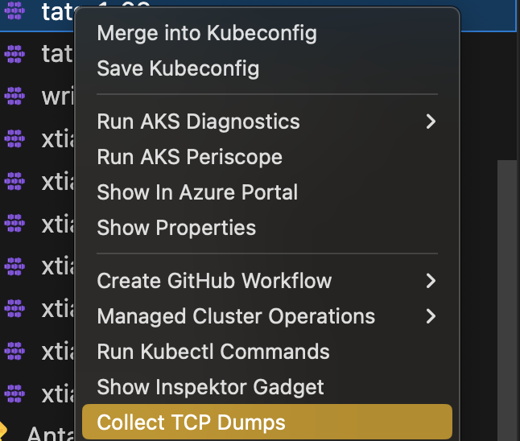
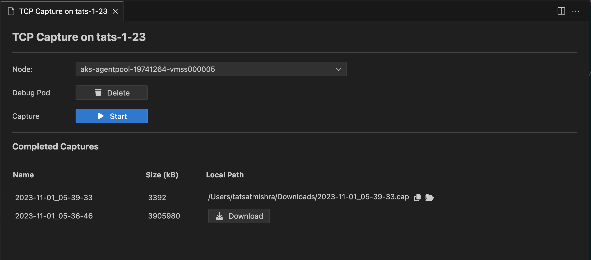
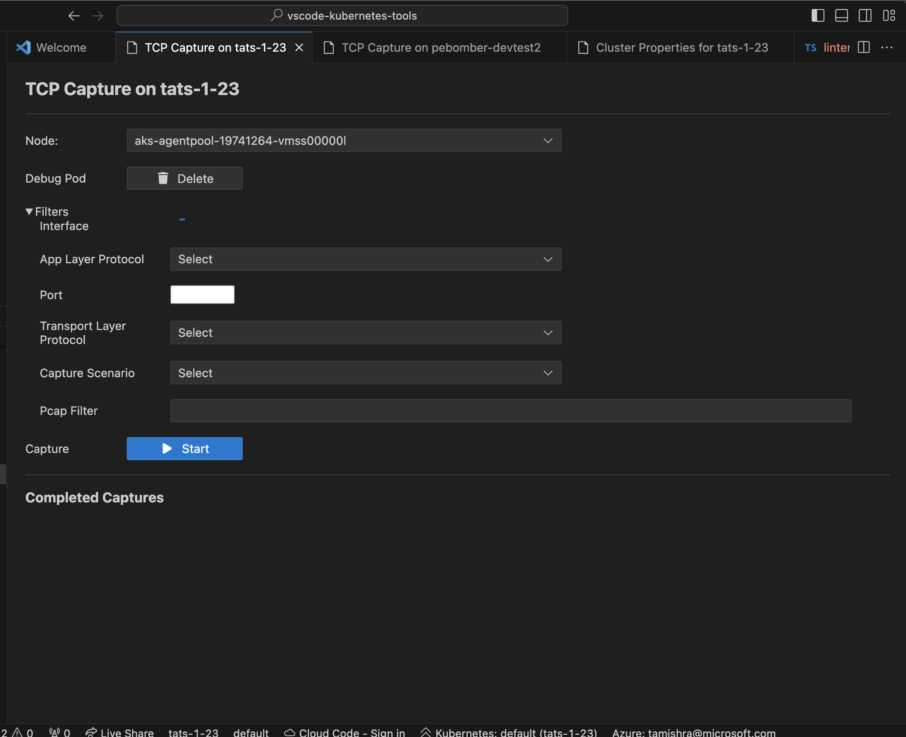
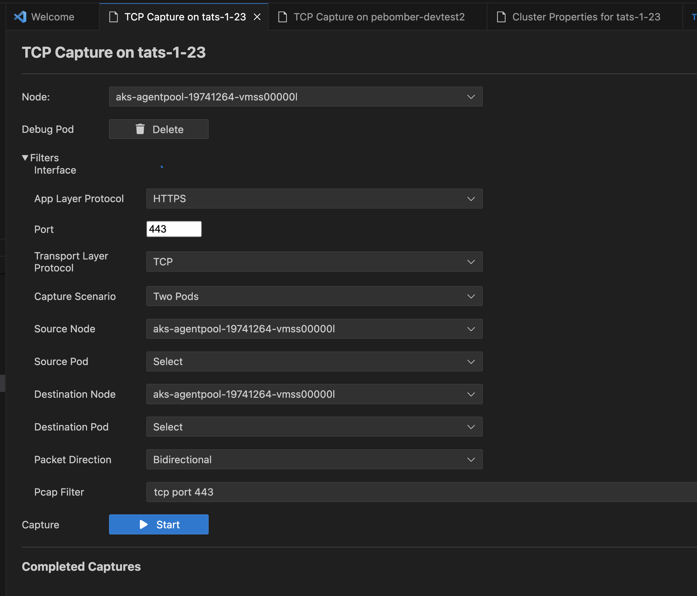

# Collect TCP Dumps from AKS Cluster Linux Nodes

### Collect TCP Dumps

Right click on your AKS cluster and select **Troubleshoot Network Health** and then select **Collect TCP Dumps** to capture TCP dumps for any Linux node and download them to your local machine with ease.

Added filters to the TCP Dump functionality, so that you can target traffic capture to specific network interfaces, ports or protocols, to or from specific pods, or craft custom [pcap filter strings](https://www.tcpdump.org/manpages/pcap-filter.7.html).

