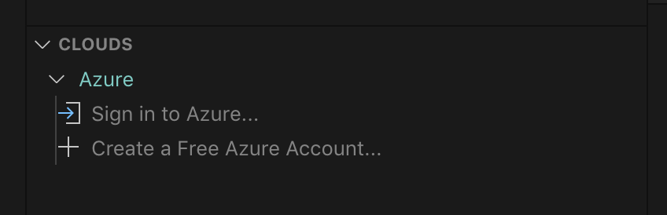

## Installation

1. Download and install the [Azure Kubernetes Service extension](https://marketplace.visualstudio.com/items?itemName=ms-kubernetes-tools.vscode-aks-tools) for Visual Studio Code.

2. Wait for the extension to finish installing then reload Visual Studio Code when prompted.

3. Once the installation is complete, you'll see a section named **Azure** under **Clouds**.

4. Sign in to your Azure Account by clicking **Sign in to Azure…**, (Afternatively, user can use `ctrl + shift + p` or `cmd + shift + p` and choose `AKS: Sign in to Azure`) screenshot below could guide the switch for account as well. If your account has access to more than one Azure tenant, you will be prompted to pick one. To change the selected tenant later, you can run `AKS: Select tenant...` from the command palette `ctrl + shift + p` or `cmd + shift + p`.

