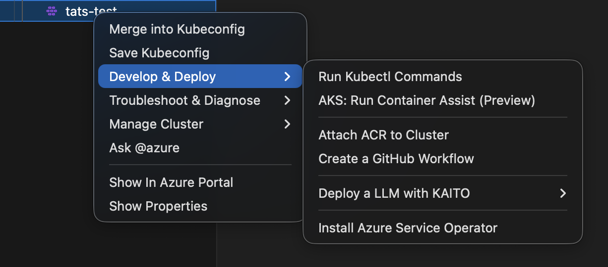
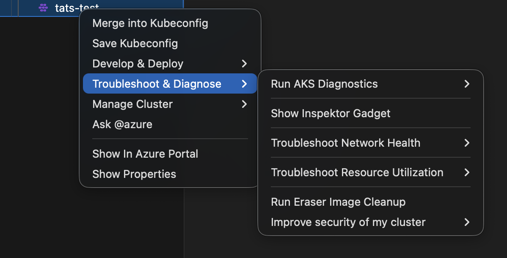
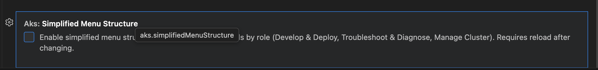

# What's New in 1.7.0

Version `1.7.0` introduces new capabilities with explicit feature-flag control so teams can adopt changes progressively.

## Release focus

This release is centered on two feature-flagged improvements:

- Container Assist integration (preview)
- Simplified, role-based AKS context menu

Both are opt-in and can be enabled independently.

## Feature flags at a glance

```json
{
  "aks.containerAssistEnabledPreview": true,
  "aks.simplifiedMenuStructure": true
}
```

Defaults:

- `aks.containerAssistEnabledPreview`: `false`
- `aks.simplifiedMenuStructure`: `false`

## 1) Container Assist integration (Preview)

Container Assist helps generate AKS deployment assets directly from your project with an optional GitHub handoff flow.

Highlights:

- New preview commands in Explorer and AKS cluster menus
- Guided generation for Dockerfile and Kubernetes manifests
- Optional GitHub workflow generation for AKS deployment
- Post-generation flow to stage changes, review in SCM, and open a PR

Read full details:

- [Container Assist Integration (Preview)](../features/container-assist-integration.md)

## 2) Simplified AKS menu structure (Feature Flag)

AKS cluster right-click actions can now be grouped by user intent under:

- `Develop & Deploy`
- `Troubleshoot & Diagnose`
- `Manage Cluster`

This reduces top-level clutter while preserving access to existing operations.

Read full details:

- [Simplified AKS Menu Structure (Feature Flag)](../features/simplified-menu-structure.md)

## Behavior and compatibility

- Existing behavior remains the default when feature flags are not enabled.
- Teams can trial either feature in preview environments before broader rollout.
- No mandatory migration is required for readers who keep defaults.

## Recommended reader path

1. Enable one flag at a time in local settings.
2. Validate expected menu visibility and command flow.
3. Roll out to team settings after confirmation.

## Screenshots







