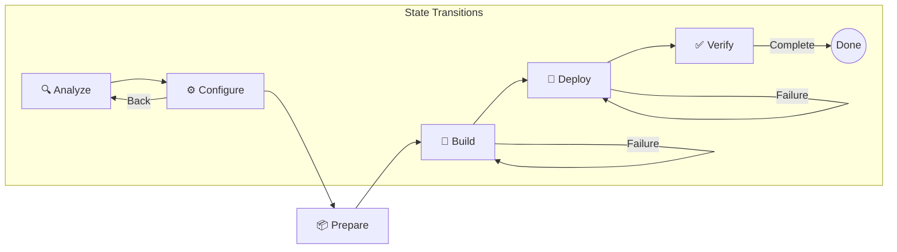

# Kickstart Phase-Based Deployment Flow

Kickstart provides a guided, 6-phase pipeline for deploying applications to Azure Kubernetes Service (AKS). Each phase includes visual progress indicators, validation gates, and error recovery to ensure a smooth deployment experience.

## Deployment Pipeline Overview

The deployment process is divided into six logical phases. You can track your progress via the phase indicator shown in every response from `@kickstart`.

### The 6 Phases

| Phase | Description | Key Output |
| :--- | :--- | :--- |
| **🔍 Analyze** | Inspects your workspace to detect language, framework, and ports. | Project Metadata |
| **⚙️ Configure** | Helps you select your Azure Subscription, AKS Cluster, and Container Registry. | Deployment Target |
| **📦 Prepare** | Generates an optimized Dockerfile and Kubernetes manifests. | Deployment Artifacts |
| **🔨 Build** | Builds your container image and pushes it to your Azure Container Registry. | Container Image |
| **🚀 Deploy** | Applies the generated manifests to your AKS cluster using `kubectl`. | Live Resources |
| **✅ Verify** | Checks pod health and provides the external endpoint for your application. | Success Verdict |

## AKS Automatic vs Standard

Kickstart automatically detects whether your target cluster is **AKS Automatic** or **AKS Standard** and adapts the deployment artifacts accordingly.

| Feature | AKS Standard | AKS Automatic |
| :--- | :--- | :--- |
| **Resource Limits** | Included in manifests (CPU/Memory) | Omitted (Managed by Automatic) |
| **Auto-scaling** | HPA manifest generated | Managed by Automatic (HPA skipped) |
| **Ingress Class** | `webapprouting.kubernetes.azure.com` | `webapprouting.kubernetes.azure.com` |
| **Node Provisioning** | Uses existing nodes | Dynamic (May take 2-3 mins on first deploy) |
| **Namespaces** | User-managed | Managed by Automatic |

## Error Recovery and Resumability

### Resilience by Design
If a phase fails (e.g., a build error or connection timeout), Kickstart provides clear error details and a **Retry** button. You don't have to restart the entire process; you only retry the failed step.

### State Resumability
Your deployment progress is saved to your workspace state. You can close VS Code, return later, and resume exactly where you left off by typing `@kickstart continue` or `@kickstart status`.

### Jumping Back
If you realize you need to change your cluster or registry after generating artifacts, you can jump back to the configuration phase by typing `@kickstart reconfigure`. Kickstart will preserve your project analysis but clear downstream data to ensure consistency.

## Example Conversation

**User:** `@kickstart deploy this app to AKS`

**Kickstart:** 
🔍 **Analyze** → ⚙️ Configure → 📦 Prepare → 🔨 Build → 🚀 Deploy → ✅ Verify

I've analyzed your project:
- **Language:** Node.js (Express)
- **Port:** 3000
- **Existing Assets:** None detected

[Configure Azure target]

---

**User:** (Clicks Configure Button, selects resources)

**Kickstart:**
🔍 Analyze → ⚙️ **Configure** → 📦 Prepare → 🔨 Build → 🚀 Deploy → ✅ Verify

Targeting **my-aks-cluster** (AKS Automatic).
- Subscription: `Azure Internal`
- Registry: `myregistry.azurecr.io`
- Pre-flight checks: ✅ Kubeconfig, ✅ ACR Access

[Generate deployment files]

---

**User:** (Clicks Generate Button)

**Kickstart:**
🔍 Analyze → ⚙️ Configure → 📦 **Prepare** → 🔨 Build → 🚀 Deploy → ✅ Verify

I've generated your artifacts for **AKS Automatic**:
- Omitted resource limits and HPA (managed by Automatic)
- Set ingress class to `webapprouting`

[Save Dockerfile] [Save Manifests]
[Build & push image]
